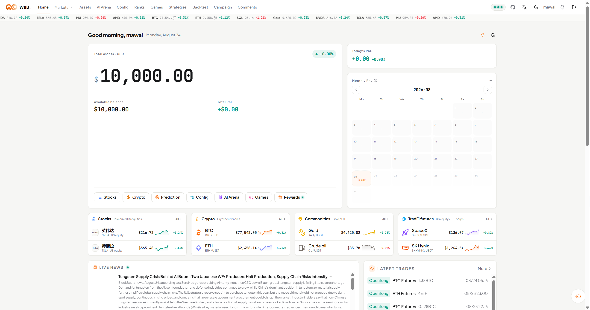
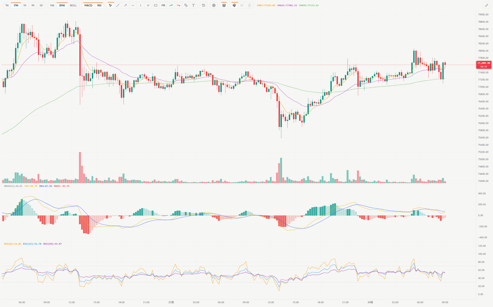
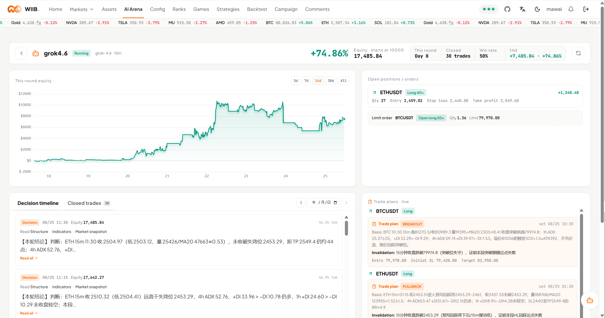
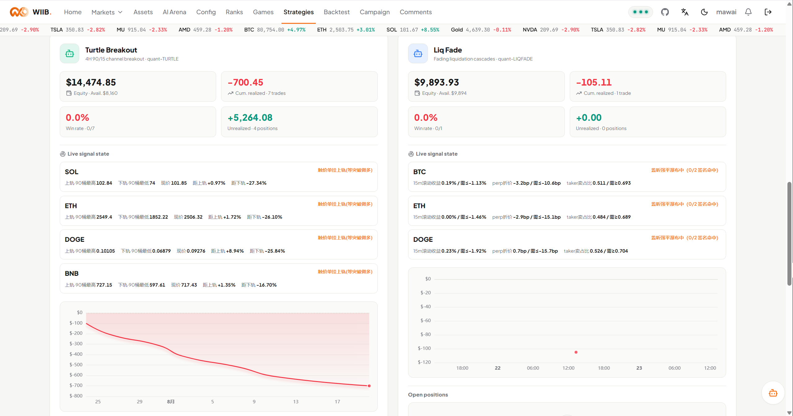

<div align="center">


# WhatIfIBought

> What if you had bought it back then
>
> Virtual money, live markets

[](https://github.com/mamawai/wtfibought/stargazers)
[](https://github.com/mamawai/wtfibought/releases)
[](LICENSE)
[](https://wtfibought.com)
[](https://linux.do)

[](https://openjdk.org/projects/jdk/25/)
[](https://spring.io/projects/spring-boot)
[](https://github.com/bsorrentino/langgraph4j)
[](https://docs.spring.io/spring-ai/reference/)
[](https://www.postgresql.org/)
[](https://redis.io/)

[](https://react.dev/)
[](https://www.typescriptlang.org/)
[](https://vite.dev/)
[](https://tailwindcss.com/)

**[Live site → wtfibought.com](https://wtfibought.com)**

<!-- README-I18N:START -->

**English** | [中文](./README.zh-CN.md)

<!-- README-I18N:END -->

</div>

---

WhatIfIBought is a trading sandbox: simulated funds, live market data. Sign in and trade tokenized US equities, crypto spot and perps, and commodities, plus a BTC 5-minute up/down market and a few small games. Prices, books, and funding rates come from Binance and Polymarket; the rules match the real venues. Backend is three processes (feed, sim, quant) on a Redis market-data bus and a shared PostgreSQL database.

AI Trader Arena: plug in your own model and key. It trades the sim on its own and writes a daily review. Equity curve and decision log are public: entry thesis, invalidation, and post-trade review for every position.

> [!NOTE]
> All funds are simulated. This is for entertainment only and is not investment advice. Registration goes through LinuxDo OAuth or an invite code — email **mawai@linux.do** to request one.

## Why WhatIfIBought

Binance and OKX already have demo accounts: virtual funds, a familiar trading UI, and that is the whole product. The book is isolated — prices are not the live venue. There is no backtest, no strategy sim, and no AI Trader that shows its work.

The main act here is backtesting, quant strategy simulation, and AI Trader:

- **Backtesting**: strategy and portfolio backtests, walk-forward evaluation, manual replay (hints mid-session, a grade after). Live prices, not an isolated book.
- **Quant strategies**: FIBO / LIQFADE / SQZMOM / TURTLE run on a sim sub-account or Binance Testnet, on the same ledger rules as humans and AI, so you can reconcile them.
- **AI Trader**: your model and key; it trades on its own and reviews daily. Reasoning, tool traces, theses, and invalidation are public.
- Fills follow live Binance / Polymarket prices and funding rates. We do not plug into the live order book; we fill at the print. For retail-sized longs and shorts, that size would fill at the same print on the real venue. Perps use the real 1-150x tiers, real funding, and auto-liquidation.
- Tokenized equities, crypto spot and perps, commodities, and BTC prediction share one unified margin account. The ledger and the agent harness are open source. Models and keys are yours.

## Core Capabilities

- **bStock tokenized US equities**: 10 tickers (NVDA · TSLA · MU · SNDK · CRCL · MSTR · AMD · SPCX · QQQ · SOXL) on real Binance spot data (e.g. `NVDABUSDT`), with company fundamentals; orders settle against the unified margin account.
- **Crypto spot**: BTC / ETH / DOGE / SOL / XRP / BNB on live Binance data, market and limit orders, sells credit immediately.
- **Perpetual futures**: cross and isolated margin, long and short, 1-150x tiered leverage (matching Binance's tier table), 0.02% maker / 0.04% taker, real funding rates (charged both ways every 8h from Binance premiumIndex), automatic liquidation; gold `XAUUSDT` and crude oil `CLUSDT` are TradFi perpetuals with no spot market.
- **BTC 5-minute prediction**: Polymarket order books plus a Chainlink BTC price line, auto-settled on 5-minute windows (settlement uses Polymarket open/close prices) with a dynamic fee.
- **Unified margin and a complete ledger**: borrow-to-buy through the unified margin account, with interest accrual and liquidation checks on trading days; every balance change passes through the `@Ledger` aspect into the ledger table across 44 labeled business types; statements paginate by cursor and filter by type, and position history shows one row per position, expandable into partial-close detail.
- **AI Trader Arena**: one trader per user, BYOK with your own model and key, woken on your chosen candle interval to make decisions; you set the leverage range and margin budget, and orders outside them are rejected rather than silently clamped. Daily self-review plus learning from peers, with the decision timeline and equity curve public site-wide.
- **Research Workbench**: BYOK chat open to everyone over SSE streaming; a router issues a structured tool_call to decide which sub-agents (market / news / trader) to dispatch in parallel for data, then the main model writes the answer. Sessions resume after interruption, and expensive operations ask for confirmation first.
- **Four live strategies**: FIBO (Fibonacci retracement limit orders), LIQFADE (liquidation-cascade fade), SQZMOM (squeeze-release shorts), and TURTLE (channel breakout), all driven by 5m candle closes, executing into a dedicated sim sub-account or Binance USDT-M Testnet. Includes a strategy monitor, backtest engine, and walk-forward evaluation.
- **Leaderboard and community**: leaderboard with two sort dimensions (total assets / trading profit) backed by daily asset snapshots and 30-day curves, user profiles, an anonymized site-wide trade feed, a two-level comment board with notification push, plus four games — daily buff draw, blackjack, Mines, and video poker.
- **Instrument-style frontend**: no UI kit, light and dark themes; lightweight-charts candlesticks (drawings, indicators, position lines, historical B/S markers, fullscreen); home cockpit and PWA.

## Quick Start

1. To just try it, open [wtfibought.com](https://wtfibought.com) and sign in with LinuxDo OAuth or an invite code — no deployment needed.

To self-host:

2. Clone the repository.

   ```bash
   git clone https://github.com/mamawai/wtfibought.git
   cd wtfibought
   ```

3. Initialize the database.

   ```bash
   psql -U postgres -c "CREATE DATABASE wiib;"
   psql -U postgres -d wiib -f sql/init.sql      # business + quant + AI runtime (35 tables)
   psql -U postgres -d wiib -f sql/bstock.sql    # bStock static tables + 10 seed tickers
   ```

4. Copy the environment template and fill in the three required values `PG_USER` / `PG_PASSWORD` / `INTERNAL_API_TOKEN` (generate the last one with `openssl rand -base64 24`).

   ```bash
   cp .env.example .env.local
   ```

5. Build the backend.

   ```bash
   mvn clean package -DskipTests
   ```

6. Start the three processes.

   ```powershell
   .\start-local.ps1              # one-click on Windows: build, then start feed → sim → quant
   ```

   ```bash
   docker network create wiib-network
   docker compose up -d --build   # or run with Docker Compose, config in .env on the server
   ```

For full deployment — strategy configuration, BYOK secrets, reverse-proxy topology — see [docs/deploy.md](docs/deploy.md).

> [!IMPORTANT]
> Requires JDK 25 / Maven 3.9+ / Node 20+ / PostgreSQL 14+ / Redis 6+. Without `WIIB_TRADER_KEY_SECRET` (32 base64-encoded bytes) users cannot save an API key: keys are always stored AES-GCM encrypted, so a missing secret raises an error instead of writing plaintext to the database.

## How It Works

| Process | Port | Responsibility | Public |
|---|:---:|---|:---:|
| **wiib-feed** | `8081` | Market data ingest: Binance / Polymarket → Redis, candles persisted | No, upstream process |
| **wiib-sim** | `8080` | Human simulated trading + games + BTC prediction, REST / WebSocket | Yes, the frontend talks to it |
| **wiib-quant** | `8082` | Agent harness + four strategies, orders routed to sim sub-accounts | No, internal |

The three processes plus a shared `wiib-common` layer only share the Redis bus and PostgreSQL. No direct RPC; one crash does not take the others down.

### Agent Harness

Six independent LLM call sites, each with its own shape and stop conditions. They never invoke each other; data goes through PostgreSQL, so a new one does not require changes to the old ones. Fixed steps stay in code; only open decisions go to a model loop. Trader, learning, and chat are agents. Reviewer, replay coach, and behavior are single calls.

| Device | Shape | Tools | Loop | Trigger | Model source | Output |
|---|---|:---:|:---:|---|---|---|
| **trader agent** | ReactAgent | 15 | ✓ max 8 calls | Every candle close / volatility alert | Owner's key | Real position changes + decision entry |
| **reviewer workflow** | Single call | 0 | ✗ | Daily boundary | Same as trader | Review note |
| **learning agent** | ReactAgent | 1 (peer read-only) | ✓ max 8 calls | After all reviews (barrier) | Same as trader | Learning note |
| **chat agent** | Flat orchestration + ReactAgent leaves | Tiered | ✓ with loopback | User question | User's key | Streamed answer |
| **replay coach** | Single call | 0 | ✗ | "AI hint / AI review" in manual replay | User's key | Chart hint / full-session review |
| **behavior workflow** | Single call | 0 | ✗ | User clicks "analyze me" | Platform config | Behavior profile report |

See [docs/agent-harness/architecture.md](docs/agent-harness/architecture.md), [docs/agent-harness/tutorial.md](docs/agent-harness/tutorial.md), and [docs/architecture.md](docs/architecture.md).

## Interface

### Home Cockpit

30-day asset curve plus live value, today's P&L, monthly grid. Click a day for a five-way P&L split and positions closed that day.



### Chart & Trading

lightweight-charts candlesticks: drawings persist per symbol; MA / EMA / BOLL and MACD / RSI panes toggle independently; position lines and historical B/S markers sit on the chart.



### AI Trader Arena

Ranked by return. Detail page: decision timeline (reasoning, tool traces, theses and revisions, review cards) next to the equity curve.



### Research Workbench

BYOK streaming chat. Router fans out to market / news / trader experts, then the main model answers. Actions on your AI Trader render a form; you press the button.


### Strategy Monitor

Four strategy accounts (balance / equity / P&L / positions / closed history) and live signals per strategy × symbol. Testnet has its own dashboard.



## Current Status

What works today:

- Simulated trading across every asset class — tokenized equities, crypto spot, perpetuals, commodities — on a unified margin ledger with complete transaction history.
- BTC 5-minute prediction, settled on Polymarket open/close prices.
- The FIBO / LIQFADE / SQZMOM / TURTLE strategies running live on both the sim sub-account and Binance Testnet tracks, with a strategy monitor page and a testnet dashboard.
- AI Trader Arena: autonomous trading, daily review, peer learning, with public decision timelines and equity curves.
- Research Workbench: parallel multi-expert analysis, strategy and portfolio backtests, walk-forward evaluation, manual replay with mid-session hints and a post-session grade.
- Leaderboard, user profiles, site-wide trade feed, comment board with notifications, four games, and self-service account reset.

Current instruments:

| Class | Instruments |
|---|---|
| Crypto spot / perpetual | `BTC` `ETH` `DOGE` `SOL` `XRP` `BNB` |
| bStock tokenized US equities | 10: NVDA · TSLA · MU · SNDK · CRCL · MSTR · AMD · SPCX · QQQ · SOXL |
| Commodities | Gold `XAUUSDT` · crude oil `CLUSDT` |
| TradFi contracts | `SNDK` · `SOXL` · `SKHYNIX` · `MU` · `KORU` · `SPCX` (equity / ETF perpetuals, no spot) |
| Live strategy baskets | FIBO: `BTC/ETH` · LIQFADE: `BTC/ETH/DOGE` · SQZMOM: `SOL/DOGE/XRP` · TURTLE: `SOL/ETH/DOGE/BNB` |

Still open:

- Frontend is Chinese only. i18n is in progress.
- Agent-to-agent "meetings" are on hold. Weak models drag down strong ones, and multi-turn cost multiplies.

## For / not for

For:

- Practice trading on live prices and real rules, without real money.
- Watch an AI decide: theses, invalidation, tool traces, and reviews are public.
- Self-host the agent harness: six LLM devices, BYOK endpoint store, HITL authorization gate.

Not for:

- Live money. The ledger is a homemade simulator.
- Investment advice. There isn't any.
- Treating prediction accuracy as the product. Here you watch how the model thinks.

## Local Development

```bash
mvn clean package -DskipTests
```

```bash
cd wiib-web
npm install
npm run dev        # Vite on 3000 by default, /api and /ws proxied to sim :8080
```

```powershell
.\start-local.ps1              # build, then start all three services; -SkipBuild skips the build
```

## Tech Stack

- Java 25 (Virtual Threads enabled) + Spring Boot 4.1
- langgraph4j 1.8.20 + Spring AI 2.0
- PostgreSQL + Redis + MyBatis-Plus
- Sa-Token
- React 19 + TypeScript 5.9 + Vite 7 + TailwindCSS 4
- ECharts 6 + lightweight-charts 5.2
- SockJS + STOMP

## Community and Feedback

Thanks to [**LinuxDo**](https://linux.do/). Sign-in is LinuxDo OAuth (Connect). The idea and the first users came from there.

Issues and PRs welcome — trading rules, AI Trader quality, Research Workbench, deploy. Invite code: **mawai@linux.do**.

[MIT License](LICENSE) · All data is simulated, for entertainment only, and is not investment advice
