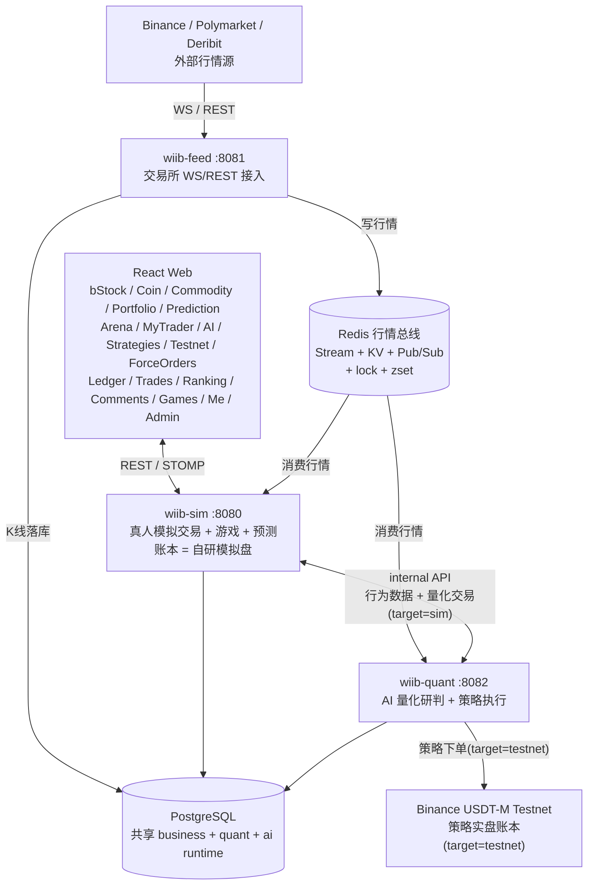
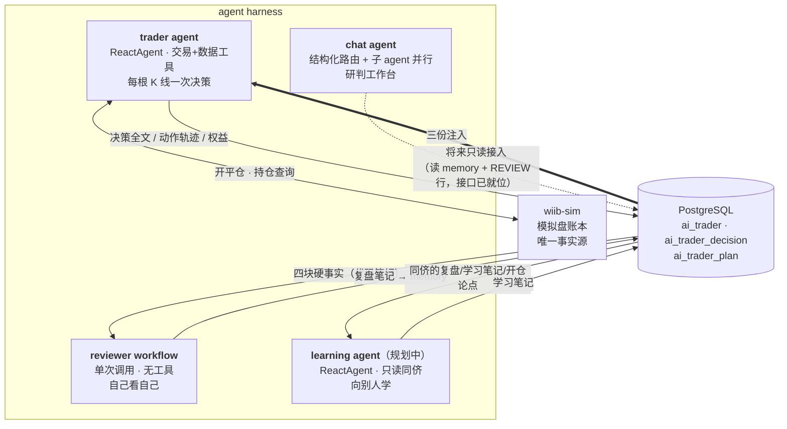
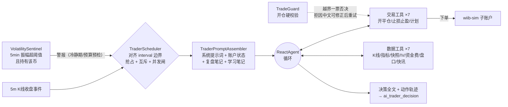
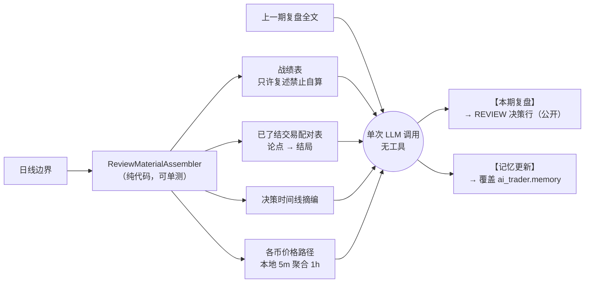
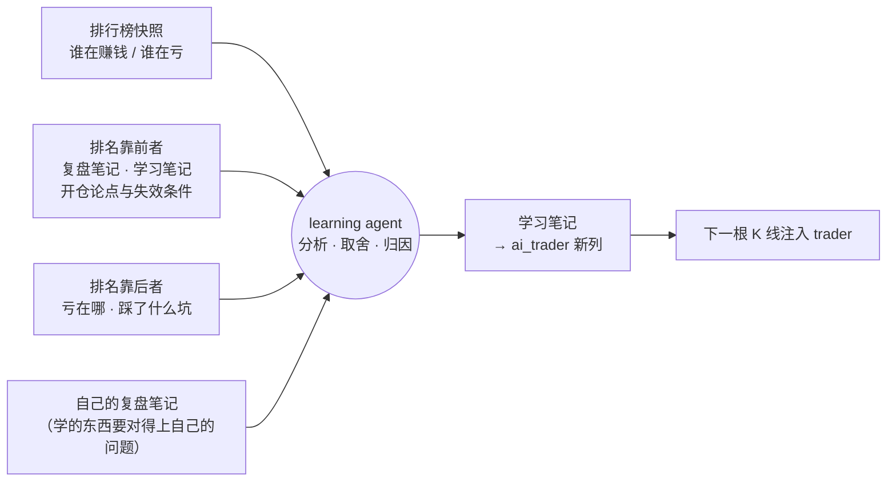
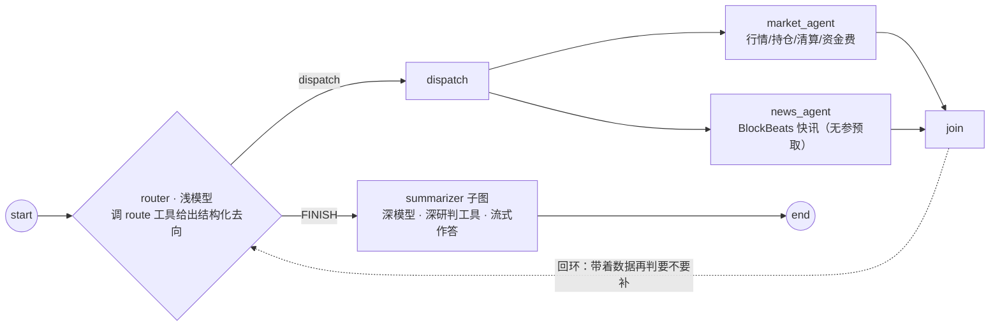
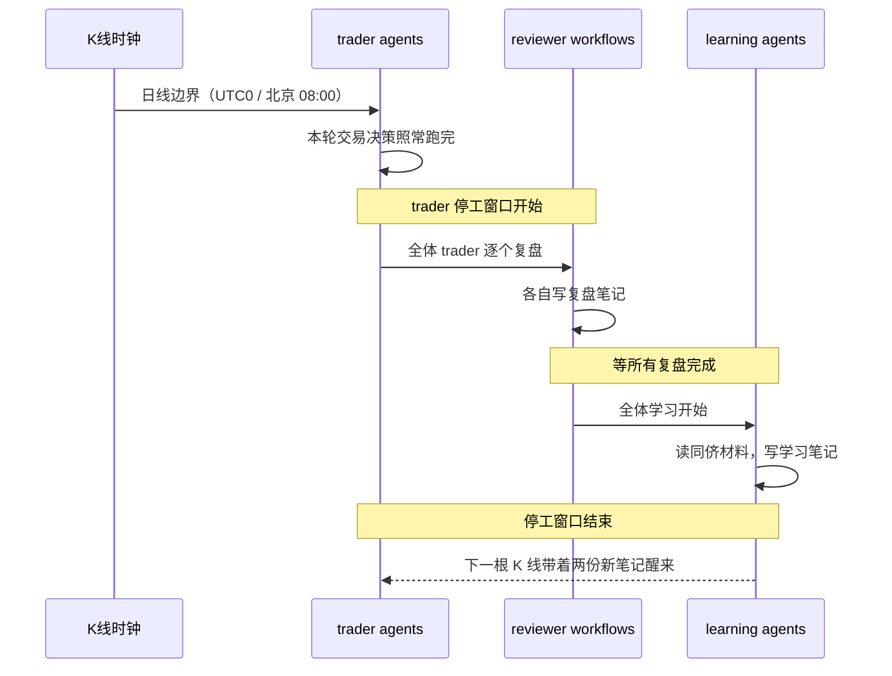

<div align="center">


# WhatIfIBought

**如果当初买了会怎样**

代币化美股 · 加密现货 / 永续 · 大宗商品 · BTC 预测 · AI 量化研判
—— 一个用虚拟资金跑真实行情的交易实验平台

<br/>

[](https://openjdk.org/projects/jdk/25/)
[](https://spring.io/projects/spring-boot)
[](https://github.com/bsorrentino/langgraph4j)
[](https://docs.spring.io/spring-ai/reference/)
[](https://www.postgresql.org/)
[](https://redis.io/)

[](https://react.dev/)
[](https://www.typescriptlang.org/)
[](https://vite.dev/)
[](https://tailwindcss.com/)
[](LICENSE)

<br/>

**[线上体验 → wtfibought.com](https://wtfibought.com)**

[定位](#当前定位) · [功能](#功能概览) · [技术栈](#技术栈) · [架构](#系统架构) · [Agent Harness](#agent-harness-架构) · [数据链路](#实时数据链路) · [部署](#部署)

</div>

---

## 当前定位

用户通过 LinuxDo OAuth 登录，用虚拟资金体验代币化美股、加密现货 / 永续合约、大宗商品、BTC 5 分钟涨跌预测和小游戏，
并围观一座 **AI Trader 竞技场**——每个人接自己的模型与 key，让它在纯模拟盘里自主交易、每日复盘，净值曲线与决策日志全程公开。

后端按业务域拆成 **3 个独立进程** + `wiib-common` 共享层，经 **Redis 行情总线**和**共享 PostgreSQL** 协作，进程级故障隔离（一个崩不连累其他）。

| 进程 | 端口 | 职责 | 对外 |
|---|:---:|---|:---:|
| **wiib-feed** | `8081` | 统一接入 Binance（现货 + 永续 WS/REST）与 Polymarket，写入 Redis（Stream / KV / Pub-Sub），crypto 永续 5m K 线落库 | ✗ 上游进程 |
| **wiib-sim** | `8080` | 真人模拟交易 + 游戏 + BTC 预测，账本 = 自研模拟盘 DB，提供 REST / WebSocket | ✓ 前端连它 |
| **wiib-quant** | `8082` | **agent harness**（AI Trader 竞技场 / 复盘 / 研判工作台）+ FIBO / LIQFADE / SQZMOM / TURTLE 四策略，同由 5m K 线收盘驱动；下单一律走 sim 的独立子账户，不碰真人账本 | ✗ 内部 |

> 策略执行目标二选一（`strategy.execution.target=sim｜testnet`）：本平台模拟盘的独立量化账户 `quant-<策略ID>`，或 Binance USDT-M Testnet。

### 当前标的

| 品类 | 标的 |
|---|---|
| 加密现货 / 永续 | `BTC` `ETH` `DOGE` `SOL` `XRP` `BNB` |
| bStock 代币化美股（10） | NVDA · TSLA · MU · SNDK · CRCL · MSTR · AMD · SPCX · QQQ · SOXL（Binance 现货，如 `NVDABUSDT`） |
| 大宗商品 | 黄金 `XAUUSDT` · 原油 `CLUSDT`（TradFi 永续，无现货） |
| TradFi 合约 | 闪迪 `SNDK` · `SOXL` · SK海力士 `SKHYNIX` · 美光 `MU` · `KORU` · SpaceX `SPCX`（美股/ETF 永续，无现货，盈亏归股票桶） |
| 策略实盘篮子 | FIBO: `BTC/ETH` · LIQFADE: `BTC/ETH/DOGE` · SQZMOM: `SOL/DOGE/XRP` · TURTLE: `SOL/ETH/DOGE/BNB` |

---

## 功能概览

### 交易系统

- **bStock 代币化美股**：真实 Binance 现货行情（价与实时 5m 蜡烛来自 feed→Redis 实时流，K 线历史代理 REST），含公司基本面；下单挂靠统一保证金账户。
- **加密货币现货**：BTC/ETH/DOGE/SOL/XRP/BNB，接入 Binance 实时行情，市价 / 限价单，卖出即时到账。
- **永续合约**：全仓 / 逐仓双模式（全仓为主，整个余额钱包为仓位兜底，强平线随净值与全部仓位浮盈亏实时变化），多 / 空双向，1-150 倍分档杠杆（对齐 Binance 档位表），maker 0.02% / taker 0.04%，真实资金费率（每 8h 按 Binance premiumIndex 双向收付，拉取失败回退 0.01%），自动强平。
- **大宗商品**：黄金 / 原油 TradFi 永续。
- **保证金 / 计息 / 爆仓 / 破产恢复**：借款买入统一保证金账户，交易日 17:00 计息 + 爆仓检查，09:00 破产用户幂等恢复。
- **BTC 5 分钟涨跌预测**：接入 Polymarket 盘口 + Chainlink BTC 价格线，5 分钟窗口自动结算（结算基准 = Polymarket 开 / 收盘价，Chainlink 仅前端价格线展示），动态手续费。

### 资金账本

- **全量记账**：所有资金变动经 `@Ledger` **AOP 切面**落 `user_ledger` 流水表，`balance_after` 取自同条 `UPDATE ... RETURNING`（不重查，天然与真实扣减同事务同一致），44 种业务类型带中文语义标注（另有 `UNKNOWN` 兜底，切面漏标也不丢账）。
- **账单页**：游标翻页（`id` 倒序，服务端封顶 100/页）+ 按业务类型筛选，中文 label 只在 `LedgerBizType` 枚举里维护一处，前端不再抄一份映射。
- **合约仓位历史**：一行一笔完整仓位，展开看分批平仓明细（已平仓量 / 平仓均价 / 已实现盈亏从订单表聚合，仓位表那两列只是残值）。

### 策略实盘

| 策略 | 周期 | 逻辑 |
|---|:---:|---|
| **FIBO** | 5m | 斐波回撤限价挂单 |
| **LIQFADE** | 5m | 强平瀑布 fade 仅做多；瀑布 / premium 折价 / taker 卖压三签名至少中二，1h 时间出场 |
| **SQZMOM** | 4H | 压缩释放仅做空 |
| **TURTLE** | 4H | 通道突破 90 入 / 15 出，盘中触价入场，多空对称，2×ATR 灾难止损、不设固定止盈 |

- 全部由 5m K 线收盘驱动；执行 sim（每策略独立账户，与真人同规则、资金隔离）或 Binance Testnet。仓库默认四策略全启跑 sim 轨、仅白名单 symbol。
- **策略监控页**：四策略账户全景（余额 / 权益 / 盈亏 / 持仓 / 已平仓历史）、各策略 × 币种实时信号快照（通道位置 / 压缩计数 / 签名命中），管理员可手动整仓市价平；testnet 轨另有独立看板（总览 / 成交 / 日历格 / 净值曲线 / 成交质量）。

### AI Trader 竞技场与研判工作台

> **卖点不是"预测准"，是"看得见怎么想"** —— 净值曲线是记分牌，决策日志才是正片：每一笔开仓的论点、失效条件、事后复盘全程公开。

- **AI Trader**（每用户一个）：BYOK 接自己的模型与 key，按选定 K 线级别自主唤醒交易；仓位规格（杠杆区间 / 保证金占比 / 单仓 / 双开 / 自主加减仓）由主人设定，护栏硬校验越界拒不截断；持仓极端波动时哨兵临时唤醒。
- **每日复盘**：日线边界读自己一天的交易痕迹，写复盘笔记回注下一轮——战绩数字由代码算好，模型只许复述。
- **竞技场**：全员按收益率排行，点进详情看决策时间线（推理全文 / 工具轨迹 / 论点与修订史 / 复盘卡片）与净值曲线。
- **研判工作台**（管理员专属）：SSE 流式，结构化 router 调度 market / news 子 agent 并行取数，深模型 summarizer 汇总作答；断点续聊 + 跨会话记忆 + 贵操作 HITL 确认闸。
- **MCP Server**：同一工具层暴露只读市场工具（`market_snapshot` / `option_iv` / `funding_history` / `orderbook_depth`），SSE 端点，Claude Desktop / Cursor 等任意 MCP 客户端可直连。
- **研究工具**：策略 K 线 / 组合回测引擎与 walk-forward 样本外评估 REST API。
- 详见 [Agent Harness 架构](#agent-harness-架构)。

### 行情与实时数据

- **Binance WS**：现货 miniTicker、永续 markPrice、永续 miniTicker、forceOrder（订全市场流白名单过滤）、aggTrade、depth20、K 线流（crypto 永续 5m 驱动策略 / 预测并落库；15m / 1h、大宗商品与 bStock 现货 5m 仅广播）。
- **Binance REST**：K 线、ticker、funding、OI、多空比、大户持仓、taker 买卖比、盘口。
- **断线韧性**：WS 断开自动切 REST 轮询保价不中断，重连后按离线区间高低价补触发错过的限价单 / 强平；K 线缺口 REST 回补；流健康注册表 + 管理端手动重试。
- **Deribit**：DVOL 与期权 book summary（供 quant 做 IV / vol 上下文，非用户交易）。
- **宏观 / 资金面**：farside ETF 资金流、稳定币流通量、IV / OI 分位、Fear & Greed 指数（供 quant 快照上下文）。
- **Polymarket**：BTC 预测 live-data、UP/DOWN CLOB 盘口。
- **WebSocket**：SockJS + STOMP，前端订阅行情、预测、量化信号等 topic。

### 社区与社交

- **排行榜**：分页 + 双维排序（总资产 / 交易盈利），只含有过成交的用户；每日 00:00 全员资产快照（30 天资产曲线）。
- **用户主页**：榜单行 + 当前持仓 + 成交明细 / 仓位历史切换，由本人的**公开开关**门控（关了则除本人外一律 403）。
- **全站成交页**：匿名流水，交易者只给稳定假名；接口刻意不开 `userId` 入口——开了就能枚举 userId 反查假名，匿名当场失效（反射守卫测试钉着）。
- **留言板**：全站唯一，根评论 + 子评论两层，赞踩只存计数（去重靠 Redis Set 不落记录表），管理员可删除 / 禁言（`user.muted_until` 到期自动解禁）。赞与回复产生通知，顶栏信封角标 + WebSocket 点对点推送，前端按「类型 + 评论」合并展示。
- **游戏**：每日 Buff 抽奖、21 点、Mines、Video Poker；用户行为分析 Agent（quant 经 internal API 读 sim 行为数据）。
- **自助重置账户**：清空全部交易与游戏数据回到初始资金，每周一次、需逐字输入用户名确认。清理先注销 Redis 触发索引再事务删表，失败则把索引装回去。

### 前端体验

- **精密终端**仪器风自研设计系统（`.pt-card` / `.num` / `.microlabel` / `.page-shell`），亮 / 暗双主题，无 UI 框架依赖。
- **专业 K 线**（lightweight-charts 自绘）：全屏模式（内嵌周期切换）；趋势线 / 水平线 / 斐波那契 / 文字标注画线工具（磁吸落点，按币种持久化）；MA / EMA / BOLL 主图叠加与 MACD / RSI 副图各自可开关；最新价 + 收盘倒计时合体轴标签；仓位参考线（入场 / 止盈 / 止损 / 强平价，多空色系区分、单仓位显隐）；历史成交 B/S 角标（同根 K 线聚合成 B³S² 上标，点击看逐笔成交价）。
- **首页驾驶舱**：总资产曲线（30 天快照 + 实时值）、今日盈亏、月度盈亏网格（点单日下钻五分类盈亏拆解与当日已平仓位）。
- **冷启动开屏动画**：网格溶解，PC / 移动分头编排，内联在 `index.html`（首屏零 JS 依赖）。
- **PWA**：manifest + Service Worker，standalone 观感与导航适配，不锁竖屏（横屏看 K 线）。

---

## 技术栈

<table>
<tr><th>层级</th><th>技术</th><th>版本 / 说明</th></tr>
<tr><td rowspan="2"><b>运行时</b></td><td>Java</td><td>25，启用 Virtual Threads</td></tr>
<tr><td>Spring Boot</td><td>4.1.0（Web 层 JSON 随之换代到 Jackson 3，包名 <code>tools.jackson</code>）</td></tr>
<tr><td rowspan="3"><b>AI</b></td><td>langgraph4j</td><td>1.8.20（core + spring-ai + agentexecutor + postgres-saver）</td></tr>
<tr><td>Spring AI</td><td>2.0.0（OpenAI Compatible + Responses API，思考档位可配，配置在 DB）</td></tr>
<tr><td>MCP Server</td><td>Spring AI MCP Server WebMVC / SSE 2.0.0</td></tr>
<tr><td rowspan="3"><b>数据</b></td><td>PostgreSQL</td><td>共享主库，建表见 <code>sql/init.sql</code>（29 张）+ <code>sql/bstock.sql</code></td></tr>
<tr><td>Redis + Caffeine</td><td>行情总线、分布式锁、ZSet 索引 + 本地热缓存</td></tr>
<tr><td>MyBatis-Plus</td><td>3.5.17（<code>spring-boot4-starter</code>）</td></tr>
<tr><td><b>认证</b></td><td>Sa-Token</td><td>1.45.0（LinuxDo OAuth + 账号密码 / 邀请码注册，开关控制）</td></tr>
<tr><td><b>观测</b></td><td>Actuator + Micrometer</td><td>暴露 health / metrics / prometheus；LLM 调用观测经 Spring AI <code>ObservationRegistry</code></td></tr>
<tr><td rowspan="5"><b>前端</b></td><td>React + TypeScript</td><td>19.2 / 5.9</td></tr>
<tr><td>Vite</td><td>7.2 + vite-plugin-pwa</td></tr>
<tr><td>UI</td><td>TailwindCSS 4.1 + lucide-react，「精密终端」自研组件，无 UI 框架依赖</td></tr>
<tr><td>图表</td><td>ECharts 6 + lightweight-charts 5.2</td></tr>
<tr><td>状态 / 路由 / 实时</td><td>Zustand 5 + React Router 7 + STOMP over SockJS</td></tr>
</table>

---

## 系统架构



---

## Agent Harness 架构

平台跑着四套独立的 LLM 装置，各有各的形态与停止条件。**它们之间只经 PostgreSQL 解耦**——没有任何一个直接调用另一个，加一套新的不用改旧的。

图引擎 **langgraph4j 1.8.20**（spring-ai-alibaba 的上游）。选型只有一条准则：**固定步骤写死成代码，开放决策才交给模型循环**。所以四套里只有两套是真 agent。

| 装置 | 形态 | 工具 | 循环 | 触发 | 产出 |
|---|---|:---:|:---:|---|---|
| **trader agent** | ReactAgent | 14 | ✓ 上限 8 次调用 | 每根 K 线收盘 / 波动警报 | 真实开平仓 + 决策行 |
| **reviewer workflow** | 单次调用 | 0 | ✗ | 日线边界 | 复盘笔记 |
| **learning agent** | ReactAgent *(规划中)* | 只读同侪 | ✓ | 全体复盘之后 | 学习笔记 |
| **chat agent** | StateGraph + 子 agent | 分层 | ✓ 带回环 | 用户提问 | 流式回答 |

### 全景：四套装置如何经 DB 咬合



**trader 每次唤醒收到三份注入**：平台系统提示词（身份/规格/纪律）+ **复盘笔记**（自己的教训）+ **学习笔记**（从别人身上学到的）。后两份分别由 reviewer 和 learning 写，trader 侧只读——它不知道也不需要知道这两样东西是谁写的。

### trader agent：唯一会动真账本的



- **四层外生停止条件**：模型调用上限 8 次（ReAct 保险丝）、唤醒预算（截止 = 下一根 K 线前 5s）、单轮 600s 上限、连续 5 次失败自动暂停。模型无权突破任何一条。
- **事实裁定归代码**：仓位规格（杠杆区间/保证金占比/单仓/双开）由 `TradeGuard` 硬校验，越界**拒绝不截断**——平台悄悄改数字，模型不知道自己被改了，后续止损计算全错。
- **计划即承诺**：开仓必须给论点标签、数据引用、失效条件，落 `ai_trader_plan`；每次唤醒原样回注。退出只有三条路——止损带走、止盈带走、失效条件触发后主动平。计划归档不删，是 reviewer 的原料。
- BYOK：用户自带 key 与模型（AES-GCM 加密存库，baseUrl 走 SSRF 白名单校验）。

### reviewer workflow：自己看自己

**它不是 agent**——没有工具、没有循环，一次调用进去出来。这是有意的：素材由代码算齐，模型只负责解读，它没有机会自己去查一段对自己有利的行情来自证。



- **防自夸三件套**：战绩数字代码注入且只许复述；「先找错误再找亮点」；教训条数上限（防泛泛而谈刷篇幅）。
- **滚动继承**：只回注**上一期**复盘（不是全部历史），但要求这一期必须把仍然成立的教训继承进来——因为下一期同样只看得到这一篇。输入不膨胀的前提，是输出完成了继承。
- **降级安全**：缺分隔符 → REVIEW 行照存、memory 不动，一次格式失守不许污染记忆；复盘失败不计连败（没有资金风险）。

### learning agent：向别人学（规划中）

reviewer 解决"我哪儿错了"，learning 解决"**别人做对了什么，其中哪些对我真的有用**"。

之所以这个才配叫 agent：它要在一堆同侪材料里自己判断**哪些值得学、哪些是幸存者偏差、哪些是差 trader 的前车之鉴**——这是开放决策，写不成固定步骤。



设计约束（已定）：

- **不是照抄**：要求分辨"他赚钱是因为方法对，还是因为运气/行情恰好配合"，抄不可复现的东西比不学更糟。
- **好坏都看**：差 trader 的教训往往比好 trader 的经验更具体（爆仓路径是清晰的因果链）。
- **产出独立成列**：与复盘笔记分开存，trader 侧拿到的是三份并列的注入，来源清晰。

待定（**尚未决策**）：agent 之间开"会议"互相提问讨论——想法记在这里，但差模型拖累好模型是真实风险，且多轮对话成本是乘法增长。暂不做。

### chat agent：研判工作台



三个子 agent 各自是独立编译的 `ReactAgent` 子图（独立 threadId，中间消息不污染主会话 checkpoint）：**market_agent** 与 **news_agent** 并行取数，**summarizer** 汇总作答。

- **路由**：模型调 `route` 工具给出去向，结果只写 state、不进 messages；条件边只读这个结构化值，绝不解析消息文本。角色单一是关键——summarizer 一个字都不提"要不要再派发"，那正是早期无限循环的病根。
- **并行**：`dispatch` → 各专家 → `join` 是同源多边（框架内部建 `ParallelNode`）；未被派发的节点直接返回空，不触发模型调用。同一专家一轮内只派一次，另设 3 轮派发上限。
- **韧性**：自研 `ResilientChatService` 装配进 `ReactAgent.ChatService`，对图与节点透明。阻塞路径只切兜底模型（重试归模型层，两层叠乘只会放大尾延迟）；流式路径带退避重试，仅在尚未吐帧时重订阅。
- **横切**：PostgresSaver 断点续聊、跨会话长期记忆（规则化写入，不烧 LLM）、`run_deep_analysis` 贵操作 HITL 确认闸、调用限额 + 历史摘要压缩控预算。
- **新闻双源分工**：`news_agent` 出 BlockBeats 清单，summarizer 用联网搜索补充合并，独有条目带源标签——因为服务端搜索关不掉，与其硬压不如分工。

### 日线边界的时序

一天一次的交接：**先交易，再全体复盘，最后全体学习**。复盘与学习期间 trader 停工——它们要读的是"已经定格的一天"，边写边读会读到半截数据。



> 时序中 learning 阶段与"等全体复盘完成"的协调尚未实现；当前形态是每个 trader 在自己的日线边界上顺序跑「交易 → 复盘」，无全局屏障。

同一工具层的第三个消费方：**MCP Server**（SSE 端点）——Claude Desktop / Cursor 等任意 MCP 客户端可直连调用只读市场工具；新闻抓取与深研判等贵操作刻意不对外。

> **规划中的联动**：chat agent 将来可只读感知 trader（把 `TraderToolkit` 挂进 chat 图，读 memory 与 REVIEW 行即可）。接口已经就位——learning 只写笔记列与决策行，chat 只读同样两样东西，**不需要再改 trader**。

---

## 实时数据链路

### Binance

```text
wiib-feed（上游进程）  交易所 WS → Redis
  -> spot miniTicker        -> Redis 价格 KV + Pub/Sub(feed:price)
  -> futures markPrice@1s   -> Redis mark/指数价 KV + Pub/Sub(feed:price)
  -> forceOrder(全市场流)    -> 白名单过滤 -> force_order 表(DB, 天然跨进程)
  -> aggTrade               -> Redis Stream(market:orderflow:<sym>, quant 读侧聚合)
  -> depth20@100ms          -> Redis KV(DepthStreamCache)
  -> K 线收盘                -> Redis Stream(stream:kline:closed) + taker买量5m桶 KV + crypto 5m 落库
  -> WS 断线                 -> REST 轮询兜底保价, 重连后按区间高低价补触发限价/强平

wiib-sim / wiib-quant（消费进程）  从 Redis 消费 feed 写入的行情
  sim:   撮合/强平 + 预测回合消费
  quant: K线驱动预测/策略 + 波动哨兵 + LIQFADE 拉 premium/taker KV
```

sim 订阅 `feed:price` 后做撮合（feed 本身不撮合）：价格更新触发现货限价单、永续强平、止损、止盈检查。

### Polymarket BTC 预测

```text
Polymarket live-data -> Chainlink BTC price -> /topic/prediction/price（展示价格线）
Polymarket CLOB      -> UP/DOWN bid/ask     -> /topic/prediction/market
5min window rotation -> 回合事件(lock/create/settle)走 Redis Stream 保 FIFO
                     -> sim 锁上轮 -> 拉 Polymarket 开/收盘价 -> 结算下注
```

动态手续费：`effectiveRate = 0.25 * (p * (1 - p))^2`，clamp 0.1% ~ 2%。

---

## 项目结构

后端 **4 个 Maven module / 3 个独立进程**（+ 共享层），经 Redis 行情总线和共享 PostgreSQL 协作。

```text
whatifibought/                        # Maven 多 module 聚合 reactor
├── pom.xml
├── .env.example                      # 环境配置模板（唯一需手工填值的文件，复制为 .env.local / .env）
├── start-local.ps1 / .bat            # 本地一键启动三服务（bat 为双击入口，转调 ps1）
├── docker-compose.yml                # 三进程编排（无私有值，配置全在 .env）
├── redis-compose.yml                 # Redis 主从 + 哨兵栈（可选）
├── sql/                              # init.sql（29 表）+ bstock.sql（bStock 静态表 + 种子）
│
├── wiib-common/                      # 共享层：被 feed/quant/sim 共同依赖，三者互不直接依赖
│   └── market/ broadcast/ cache/ aspect/ mapper/ entity/ dto/ enums/ util/ ...
│                                     # 行情通道 / Depth·OrderFlow 缓存 / BinanceRestClient
│                                     # / KlineHistoryStore / ForceOrder mapper / InternalApiFilter
│
├── wiib-feed/                        # ① 数据流上游进程（:8081）
│   └── BinanceWsClient / PolymarketWsClient / KlineStreamCache / health(内部流健康+重试)
│
├── wiib-quant/                       # ② agent harness + 策略研究进程（:8082，下单只走 sim 子账户）
│   ├── agent/
│   │   ├── trader/                   # trader agent：调度/唤醒回路/提示词/交易工具/护栏
│   │   │                             # + 计划存取 + 审批 + 波动哨兵 + BYOK 模型工厂
│   │   ├── learning/                 # reviewer workflow：素材组装（硬事实）+ 复盘回路
│   │   ├── quant/                    # 行情特征与跨市场/期权/资金面取数节点
│   │   ├── analysis/                 # 深研判（工作台触发）+ 叙事对账
│   │   ├── research/                 # 回测 / 样本外评估 REST
│   │   ├── toolkit/                  # 统一工具层（trader / chat / MCP 三处共用）
│   │   ├── chat/                     # chat agent：router + 子 agent 并行 + summarizer + checkpoint
│   │   ├── strategy/                 # FIBO/LIQFADE/SQZMOM/TURTLE + 回测引擎
│   │   │                             # + 执行层(testnet|sim) + 账户监控
│   │   ├── llm/                      # ResilientChatService / Responses API / 摘要 / 调用限额
│   │   └── mcp/ behavior/ binance/ external/ ...
│   │                                 # MCP server / 行为 agent / Testnet 客户端
│   │                                 # / ETF 流爬取 / SimInternalClient
│   └── controller/ task/ mapper/ config/   # ResearchEval/Strategy/Testnet/Backtest... / 调度 / Deribit
│
├── wiib-sim/                         # ③ 真人模拟交易进程（:8080，账本=自研模拟盘 DB，对外）
│   ├── ledger/                       # 资金记账切面：@Ledger + LedgerAspect + 行映射
│   └── controller/ service/ mapper/ config/ task/
│                                     # 交易(bStock/crypto/futures) / 游戏 / 预测 / 结算 / WS 网关
│                                     # + 账单·排行·全站成交·仓位历史
│                                     # + BehaviorDataController（internal API 供 quant 调）
│
└── wiib-web/                         # React 前端（精密终端风）
    └── src/                          # App.tsx / pages/ components/ hooks/ stores/ api/
```

---

## 并发与一致性

| 机制 | 用途 |
|---|---|
| Virtual Threads | WS 消息处理、量化采集、调度任务、异步广播 |
| Redis 分布式锁 | 订单、仓位、用户、游戏操作互斥 |
| 数据库 CAS | 订单、预测回合、结算状态机 |
| `UPDATE ... RETURNING` | 资金变动与变动后余额同条 SQL 取回，账本不重查、不产生读写间隙 |
| Redis ZSet | 限价单、强平价、止损、止盈触发索引 |
| Redis Pub/Sub | 多实例 WebSocket 广播 |
| Caffeine + Redis | 本地热缓存 + L2 分布式缓存 |

---

## 部署

### 环境要求

| 依赖 | 最低版本 | 说明 |
|---|---:|---|
| JDK | 25 | pom `<release>` 即 25，低版本编译不过 |
| Maven | 3.9+ | 后端构建 |
| Node.js | 20+ | 前端构建（Vite 7） |
| PostgreSQL | 14+ | 主数据库（三进程共享） |
| Redis | 6+ | 行情总线、锁、Pub/Sub、会话 |

### 1. 克隆项目

```bash
git clone https://github.com/mamawai/wtfibought.git
cd wtfibought
```

### 2. 初始化数据库

```bash
psql -U postgres -c "CREATE DATABASE wiib;"
psql -U postgres -d wiib -f sql/init.sql      # 业务 + 量化 + AI runtime（29 张表）
psql -U postgres -d wiib -f sql/bstock.sql    # bStock 代币化美股静态表 + 10 只种子
```

### 3. 后端配置

密钥与结构分离：`application.yml` 直接入库（只有 `${VAR}` 占位符），真实值只存在根目录 env 文件里。本地开发复制模板填值即可：

```bash
cp .env.example .env.local    # 填 PG_USER / PG_PASSWORD（必填），其余可选
```

启动时按 `本机环境变量 > .env.local > yml 默认值` 解析；线上 Docker 部署同一文件命名为 `.env`（见第 6 节）。

要点：

- **共享库 / 总线**：三进程指向同一 PostgreSQL `wiib` + 同一 Redis，读同一份 `.env.local`；`INTERNAL_API_TOKEN` 天然一致（进程间 `/internal/**` 鉴权），不填走统一默认值。
- **LLM 配置不在 yml**：唯一来源是 DB（`ai_runtime_config` + `ai_model_assignment`）。启动后用管理员账号进 Admin 页填 LLM（API Key + Base URL + 模型名，Base URL 不含 `/v1`）并给各功能位分配，即时生效、无需重启。
- **quant 必须关掉 Spring AI 的 OpenAI 自动装配**（6 类全关，否则缺 api-key 拒绝启动）：

  ```yaml
  spring:
    ai:
      model: { chat: none, embedding: none, image: none, moderation: none, audio: { speech: none, transcription: none } }
  ```

- **策略实盘执行**（`wiib-quant`，仓库默认即四策略全启、跑 sim 轨）：

  ```yaml
  strategy:
    runtime:   { enabled: true, enabled-ids: FIBO,LIQFADE,SQZMOM,TURTLE }
    execution: { enabled: true, target: sim,
                 symbols: BTCUSDT,ETHUSDT,DOGEUSDT,SOLUSDT,XRPUSDT,BNBUSDT }
  ```

  > 策略由 K 线收盘驱动：`wiib-feed` 的 `binance.symbols` 必须覆盖上面全部标的（缺谁谁永不触发）。
  > `symbols` 是四策略部署篮子的并集；TURTLE 的触价单是 quant 内存态，由 feed 的 futures tick 触发。

### 4. 构建后端

```bash
mvn clean package -DskipTests
# 产物：
#   wiib-feed/target/wiib-feed-0.0.1-SNAPSHOT.jar     :8081 数据上游
#   wiib-quant/target/wiib-quant-0.0.1-SNAPSHOT.jar   :8082 量化策略
#   wiib-sim/target/wiib-sim-0.0.1-SNAPSHOT.jar       :8080 模拟交易（对外）
```

### 5. 构建前端

```bash
cd wiib-web
npm install
npm run build      # 开发：npm run dev（Vite 默认 3000，/api、/ws 代理到 sim :8080，
                   #        /api/ai、/api/testnet、/api/admin/ai-agent 代理到 quant :8082）
```

### 6. 启动

本地一键（Windows，构建 + 依次拉起 feed → sim → quant）：

```powershell
.\start-local.ps1              # 加 -SkipBuild 跳过构建；或直接双击 start-local.bat
```

或手动逐个起（须在仓库根目录执行，`.env.local` 按相对路径解析；IDEA 直接点各模块 Run 也可）：

```bash
java -jar wiib-feed/target/wiib-feed-0.0.1-SNAPSHOT.jar    # :8081 交易所 WS → Redis
java -jar wiib-quant/target/wiib-quant-0.0.1-SNAPSHOT.jar  # :8082 量化研判 + 策略
java -jar wiib-sim/target/wiib-sim-0.0.1-SNAPSHOT.jar      # :8080 模拟交易（对外，前端连它）
```

Docker Compose（三进程全编排；配置放服务器上的 `.env`，与 `.env.example` 同款变量）：

```bash
docker network create wiib-network
docker compose up -d --build
```

> 三服务端口均只绑 127.0.0.1（feed 8081 / sim 8080 / quant 宿主 18082），经 Nginx / Caddy 反代后对外只放 sim。
> Redis 主从 + 哨兵栈可选 `docker compose -f redis-compose.yml up -d`。

---

## 致谢

<div align="center">

<a href="https://linux.do/"></a>

感谢 [**LinuxDo**](https://linux.do/) —— 本站登录体系基于 LinuxDo OAuth（Connect），项目的灵感与早期用户也都来自佬友们。

*真诚、友善、团结、专业，共建你我引以为荣之社区。*

</div>

---

<div align="center">

[MIT License](LICENSE) · 所有数据均为模拟，仅供娱乐，不构成投资建议

</div>
