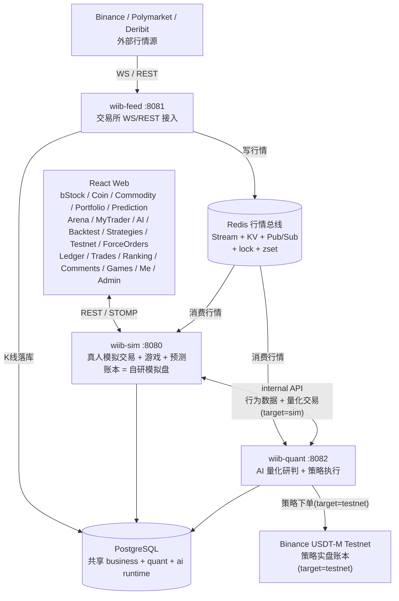
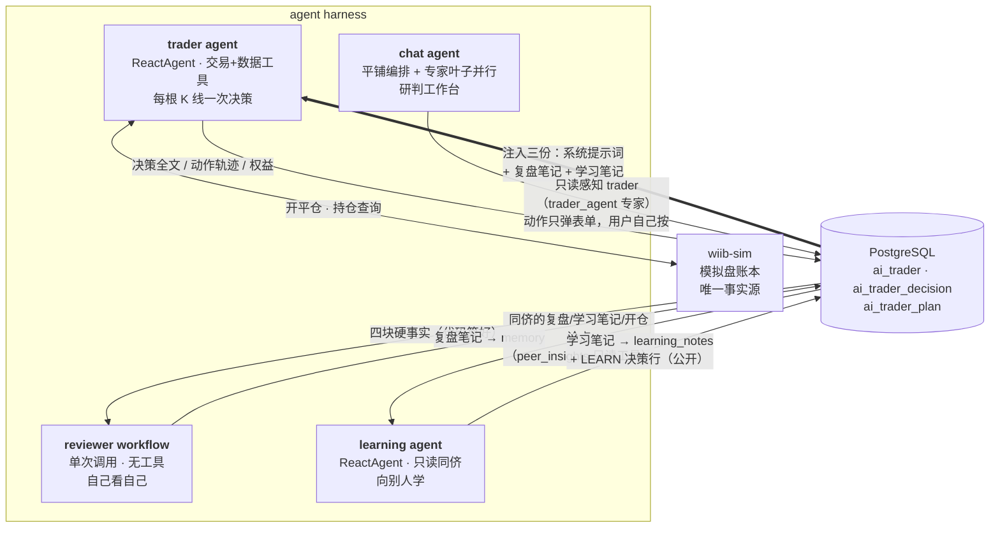
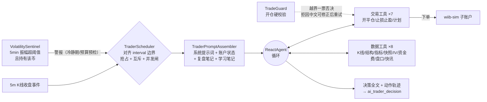
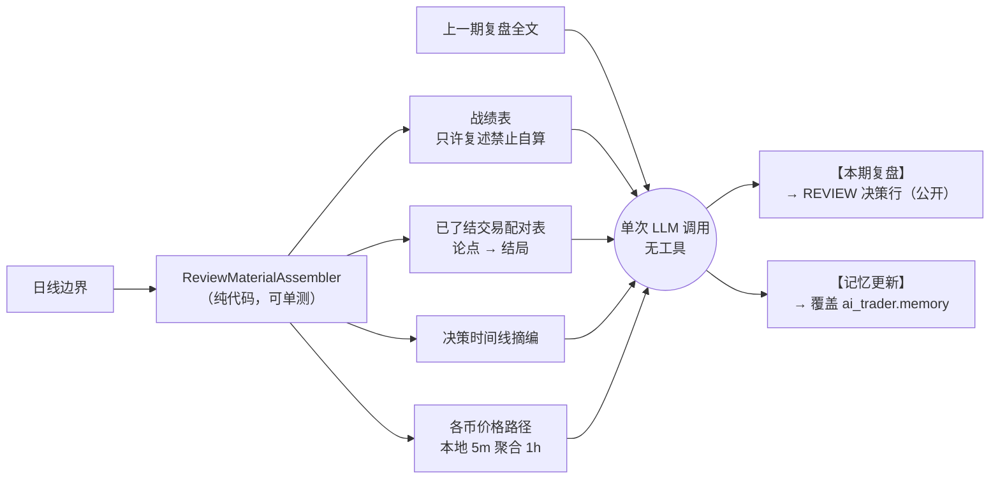
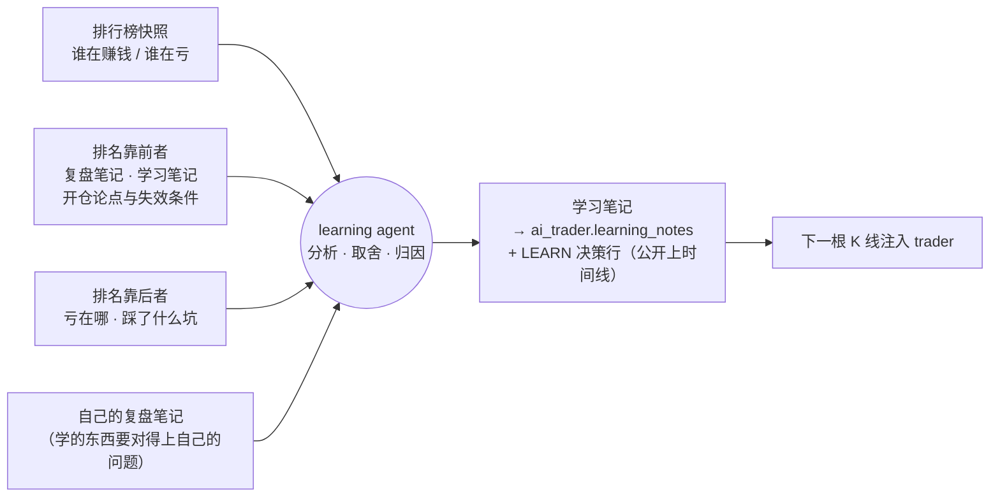
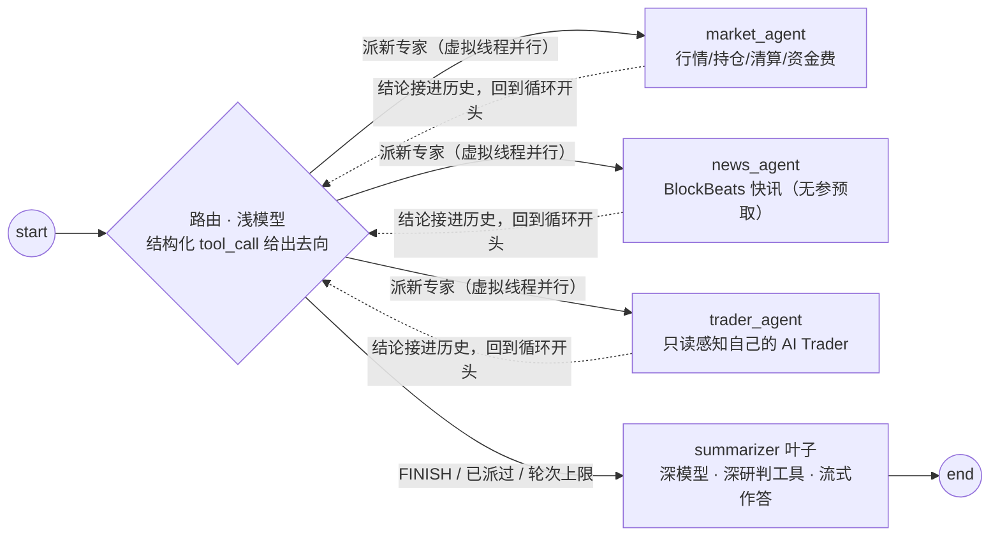
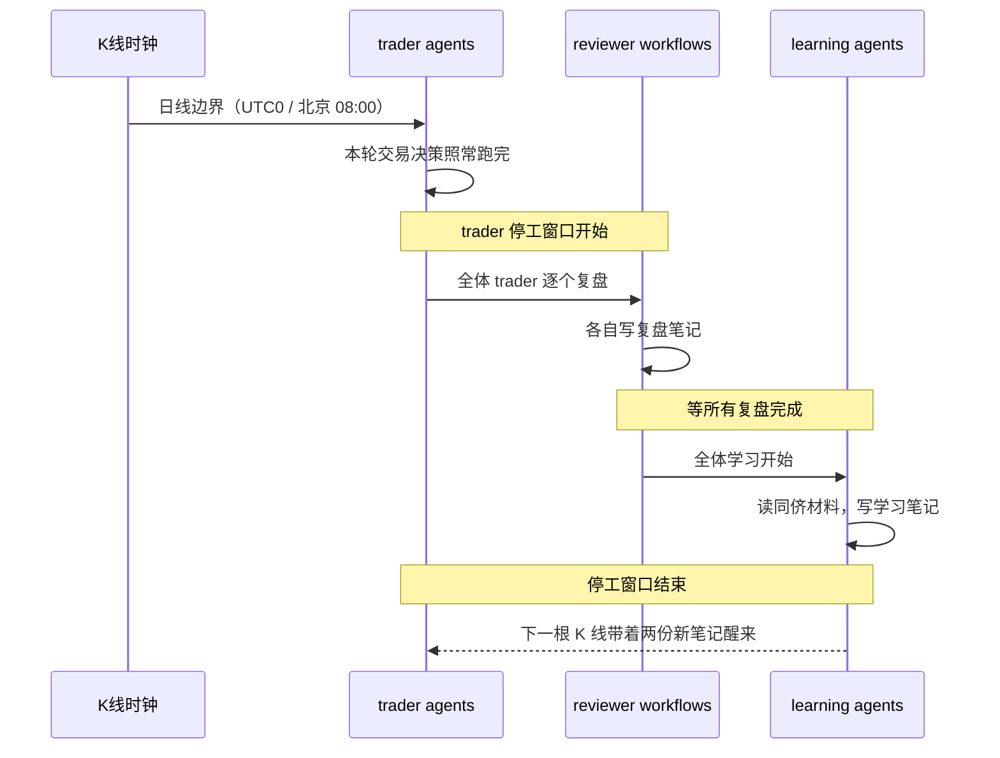

<div align="center">


# WhatIfIBought

**如果当初买了会怎样**

代币化美股 · 加密现货 / 永续 · 大宗商品 · BTC 预测 · AI 量化研判<br/>
<sub>一个用虚拟资金跑真实行情的交易实验平台</sub>

<br/>

[](https://openjdk.org/projects/jdk/25/)
[](https://spring.io/projects/spring-boot)
[](https://github.com/bsorrentino/langgraph4j)
[](https://docs.spring.io/spring-ai/reference/)
[](https://www.postgresql.org/)
[](https://redis.io/)

[](https://react.dev/)
[](https://www.typescriptlang.org/)
[](https://vite.dev/)
[](https://tailwindcss.com/)
[](LICENSE)

<br/>

**[线上体验 → wtfibought.com](https://wtfibought.com)**

[定位](#当前定位) · [功能](#功能概览) · [技术栈](#技术栈) · [架构](#系统架构) · [Agent Harness](#agent-harness-架构) · [数据链路](#实时数据链路) · [部署](#部署)

</div>

---

## 当前定位

用 LinuxDo OAuth 登录后，拿虚拟资金交易代币化美股、加密现货 / 永续合约、大宗商品，玩 BTC 5 分钟涨跌预测和几个小游戏。
另外有一个 AI Trader 竞技场：每个人接自己的模型和 key，让它在模拟盘里自己交易、每天复盘，净值曲线和决策日志对所有人公开。

后端按业务域拆成 3 个独立进程，加一个 `wiib-common` 共享层，通过 Redis 行情总线和共享 PostgreSQL 协作，一个进程挂了不影响其他两个。

| 进程 | 端口 | 职责 | 对外 |
|---|:---:|---|:---:|
| **wiib-feed** | `8081` | 行情接入：Binance / Polymarket → Redis，K 线落库 | 否，上游进程 |
| **wiib-sim** | `8080` | 真人模拟交易 + 游戏 + BTC 预测，REST / WebSocket | 是，前端连它 |
| **wiib-quant** | `8082` | agent harness + 四策略，下单走 sim 子账户 | 否，内部 |

- **wiib-feed**：统一接入 Binance（现货 + 永续 WS/REST）与 Polymarket，写入 Redis（Stream / KV / Pub-Sub），crypto 永续 5m K 线落库。
- **wiib-sim**：账本是自研模拟盘 DB，前端只连它。
- **wiib-quant**：AI Trader 竞技场 / 复盘 / 研判工作台 + FIBO / LIQFADE / SQZMOM / TURTLE 四策略，都由 5m K 线收盘驱动；下单一律走 sim 的独立子账户，不碰真人账本。

> 策略执行目标二选一（`strategy.execution.target=sim｜testnet`）：本平台模拟盘的独立量化账户 `quant-<策略ID>`，或 Binance USDT-M Testnet。

### 当前标的

| 品类 | 标的 |
|---|---|
| 加密现货 / 永续 | `BTC` `ETH` `DOGE` `SOL` `XRP` `BNB` |
| bStock 代币化美股 | 10 只：NVDA · TSLA · MU · SNDK · CRCL · MSTR · AMD · SPCX · QQQ · SOXL（Binance 现货，如 `NVDABUSDT`） |
| 大宗商品 | 黄金 `XAUUSDT` · 原油 `CLUSDT`（TradFi 永续，无现货） |
| TradFi 合约 | 闪迪 `SNDK` · `SOXL` · SK海力士 `SKHYNIX` · 美光 `MU` · `KORU` · SpaceX `SPCX`（美股/ETF 永续，无现货，盈亏归股票桶） |
| 策略实盘篮子 | FIBO: `BTC/ETH` · LIQFADE: `BTC/ETH/DOGE` · SQZMOM: `SOL/DOGE/XRP` · TURTLE: `SOL/ETH/DOGE/BNB` |

---

## 功能概览

### 交易系统

- **bStock 代币化美股**：真实 Binance 现货行情（价格与实时 5m 蜡烛来自 feed→Redis 实时流，K 线历史代理 REST），含公司基本面；下单挂靠统一保证金账户。
- **加密货币现货**：BTC/ETH/DOGE/SOL/XRP/BNB，接 Binance 实时行情，市价 / 限价单，卖出即时到账。
- **永续合约**：全仓 / 逐仓双模式（全仓为主，整个余额钱包为仓位兜底，强平线随净值与全部仓位浮盈亏实时变化），多 / 空双向，1-150 倍分档杠杆（对齐 Binance 档位表），maker 0.02% / taker 0.04%，真实资金费率（每 8h 按 Binance premiumIndex 双向收付，拉取失败回退 0.01%），自动强平。
- **大宗商品**：黄金 / 原油 TradFi 永续。
- **保证金 / 计息 / 爆仓 / 破产恢复**：借款买入统一保证金账户，交易日 17:00 计息 + 爆仓检查，09:00 破产用户幂等恢复。
- **BTC 5 分钟涨跌预测**：接 Polymarket 盘口 + Chainlink BTC 价格线，5 分钟窗口自动结算（结算基准 = Polymarket 开 / 收盘价，Chainlink 只用于前端价格线），动态手续费。

### 资金账本

- **全量记账**：所有资金变动都经 `@Ledger` 切面写入 `user_ledger` 流水表，`balance_after` 直接取自同一条 `UPDATE ... RETURNING`，不另外查一次；44 种业务类型各带中文说明，切面漏标的落到 `UNKNOWN`，不丢账。
- **账单页**：按 `id` 倒序游标翻页（服务端每页最多 100），可按业务类型筛选；中文标签只在 `LedgerBizType` 枚举里维护一份，前端不重复。
- **合约仓位历史**：一行一笔完整仓位，展开看分批平仓明细（已平仓量 / 平仓均价 / 已实现盈亏从订单表聚合，仓位表那两列只是残值）。

### 策略实盘

| 策略 | 周期 | 逻辑 |
|---|:---:|---|
| **FIBO** | 5m | 斐波回撤限价挂单 |
| **LIQFADE** | 5m | 强平瀑布 fade 仅做多；瀑布 / premium 折价 / taker 卖压三签名至少中二，1h 时间出场 |
| **SQZMOM** | 4H | 压缩释放仅做空 |
| **TURTLE** | 4H | 通道突破 90 入 / 15 出，盘中触价入场，多空对称，2×ATR 灾难止损、不设固定止盈 |

- 全部由 5m K 线收盘驱动；执行 sim（每策略独立账户，与真人同规则、资金隔离）或 Binance Testnet。仓库默认四策略全启跑 sim 轨、仅白名单 symbol。
- **策略监控页**：四策略账户全景（余额 / 权益 / 盈亏 / 持仓 / 已平仓历史）、各策略 × 币种实时信号快照（通道位置 / 压缩计数 / 签名命中），管理员可手动整仓市价平；testnet 轨另有独立看板（总览 / 成交 / 日历格 / 净值曲线 / 成交质量）。

### AI Trader 竞技场与研判工作台

这部分的重点不在预测准不准，而在于能看到模型怎么想：每一笔开仓的论点、失效条件和事后复盘都公开，净值曲线只是记分牌。

- **AI Trader**（每用户一个）：接自己的模型和 key，按选定的 K 线级别定时唤醒做决策；杠杆区间、保证金占比、单仓 / 双开、能否自主加减仓由主人设定，越界的下单直接拒绝而不是截断；持仓遇到剧烈波动时由哨兵临时唤醒。
- **每日复盘**：日线边界回看自己一天的交易，写一份复盘笔记，下一轮唤醒时注入；战绩数字由代码算好给它，模型只负责解读。
- **竞技场**：全员按收益率排行，点进详情看决策时间线（推理全文 / 工具轨迹 / 论点与修订史 / 复盘卡片）与净值曲线。
- **研判工作台**（全员开放，BYOK）：SSE 流式；路由用结构化 tool_call 决定派哪些子 agent（market / news / trader）并行取数，再由主模型汇总作答；支持断点续聊，贵操作要用户确认。对话烧的是用户自己的 key（与交易员共用同一个端点库，可以绑同一条也可以分开），平台不承担 LLM 成本；行情配额按 IP 计、分摊不了，所以并发限制在全局 10 轮 + 每用户 1 轮。
- **MCP Server**：同一工具层暴露只读市场工具（`market_snapshot` / `option_iv` / `funding_history` / `orderbook_depth`），SSE 端点。只监听本机、公网未反代；要给 Claude Desktop / Cursor 这类客户端连需要自己反代，且反代前必须先加鉴权（MCP 路径不走 quant 的登录校验）。
- **研究工具**：策略 K 线 / 组合回测引擎与 walk-forward 样本外评估 REST API；可视化回测页：策略回测任务链，以及手动复盘（按周期逐根揭示 K 线，多空双开、加减仓、杠杆随时调，AI 教练可在局中给盘面提示、结算后评估整局操作）。
- 详见 [Agent Harness 架构](#agent-harness-架构)。

### 行情与实时数据

- **Binance WS**：现货 miniTicker、永续 markPrice、永续 miniTicker、forceOrder（订全市场流白名单过滤）、aggTrade、depth20、K 线流（crypto 永续 5m 驱动策略 / 预测并落库；15m / 1h、大宗商品与 bStock 现货 5m 仅广播）。
- **Binance REST**：K 线、ticker、funding、OI、多空比、大户持仓、taker 买卖比、盘口。
- **断线处理**：WS 断开自动切 REST 轮询保价不中断，按离线区间高低价补触发错过的限价单 / 强平——feed 重连拉固定短窗（断线期间有 REST 轮询兜底），sim 重启则按 Redis 里记的停机时长回看 1m K 线（上限 1000 分钟）；K 线缺口 REST 回补；流健康注册表 + 管理端手动重试。
- **Deribit**：DVOL 与期权 book summary（供 quant 做 IV / vol 上下文，非用户交易）。
- **宏观 / 资金面**：farside ETF 资金流、稳定币流通量、IV / OI 分位、Fear & Greed 指数（供 quant 快照上下文）。
- **Polymarket**：BTC 预测 live-data、UP/DOWN CLOB 盘口。
- **WebSocket**：SockJS + STOMP，前端订阅行情、预测、量化信号等 topic。

### 社区与社交

- **排行榜**：分页 + 双维排序（总资产 / 交易盈利），只含有过成交的用户；每日 00:00 全员资产快照（30 天资产曲线）。
- **用户主页**：榜单行 + 当前持仓 + 成交明细 / 仓位历史切换，由本人的公开开关门控（关了则除本人外一律 403）。
- **全站成交页**：匿名流水，交易者只显示稳定假名；接口不提供按 `userId` 查询的入口，否则可以枚举反查假名（有反射守卫测试守着这条）。
- **留言板**：全站唯一，根评论 + 子评论两层，赞踩只存计数（去重靠 Redis Set 不落记录表），管理员可删除 / 禁言（`user.muted_until` 到期自动解禁）。赞与回复产生通知，顶栏信封角标 + WebSocket 点对点推送，前端按「类型 + 评论」合并展示。
- **游戏**：每日 Buff 抽奖、21 点、Mines、Video Poker；用户行为分析（quant 经 internal API 读 sim 行为数据，并发取数后一次 LLM 调用出报告）。
- **自助重置账户**：清空全部交易与游戏数据回到初始资金，每周一次、需逐字输入用户名确认。清理先注销 Redis 触发索引再事务删表，失败则把索引装回去。

### 前端体验

- **精密终端**仪器风自研设计系统（`.pt-card` / `.num` / `.microlabel` / `.page-shell`），亮 / 暗双主题，无 UI 框架依赖。
- **专业 K 线**（lightweight-charts 自绘）：全屏模式（内嵌周期切换）；画线工具（趋势线 / 射线 / 水平线 / 垂直线 / 平行通道 / 矩形 / 斐波那契 / 多空仓位区间 / 价格区间 / 文字；磁吸落点，按币种持久化；触屏走十字虚线拖动+轻点固定）；MA / EMA / BOLL 主图叠加与 MACD / RSI 副图各自可开关；最新价 + 收盘倒计时合体轴标签；仓位参考线（入场 / 止盈 / 止损 / 强平价，多空色系区分、单仓位显隐）；历史成交 B/S 角标（同根 K 线聚合成 B³S² 上标，点击看逐笔成交价）。
- **首页驾驶舱**：总资产曲线（30 天快照 + 实时值）、今日盈亏、月度盈亏网格（点单日下钻五分类盈亏拆解与当日已平仓位）。
- **冷启动开屏动画**：网格溶解，PC / 移动分头编排，内联在 `index.html`（首屏零 JS 依赖）。
- **PWA**：manifest + Service Worker，standalone 观感与导航适配，不锁竖屏（横屏看 K 线）。

---

## 技术栈

<table>
<tr><th>层级</th><th>技术</th><th>版本 / 说明</th></tr>
<tr><td rowspan="2"><b>运行时</b></td><td>Java</td><td>25，启用 Virtual Threads</td></tr>
<tr><td>Spring Boot</td><td>4.1.0（Web 层 JSON 随之换代到 Jackson 3，包名 <code>tools.jackson</code>）</td></tr>
<tr><td rowspan="3"><b>AI</b></td><td>langgraph4j</td><td>1.8.20（core + spring-ai + agentexecutor + postgres-saver）</td></tr>
<tr><td>Spring AI</td><td>2.0.0（OpenAI Compatible + Responses API，思考档位可配，配置在 DB）</td></tr>
<tr><td>MCP Server</td><td>Spring AI MCP Server WebMVC / SSE 2.0.0</td></tr>
<tr><td rowspan="3"><b>数据</b></td><td>PostgreSQL</td><td>共享主库，建表见 <code>sql/init.sql</code>（35 张）+ <code>sql/bstock.sql</code></td></tr>
<tr><td>Redis + Caffeine</td><td>行情总线、分布式锁、ZSet 索引 + 本地热缓存</td></tr>
<tr><td>MyBatis-Plus</td><td>3.5.17（<code>spring-boot4-starter</code>）</td></tr>
<tr><td><b>认证</b></td><td>Sa-Token</td><td>1.45.0（LinuxDo OAuth + 账号密码 / 邀请码注册，开关控制）</td></tr>
<tr><td><b>观测</b></td><td>Actuator + Micrometer</td><td>暴露 health / metrics / prometheus；LLM 调用观测经 Spring AI <code>ObservationRegistry</code></td></tr>
<tr><td rowspan="5"><b>前端</b></td><td>React + TypeScript</td><td>19.2 / 5.9</td></tr>
<tr><td>Vite</td><td>7.2 + vite-plugin-pwa</td></tr>
<tr><td>UI</td><td>TailwindCSS 4.1 + lucide-react，「精密终端」自研组件，无 UI 框架依赖</td></tr>
<tr><td>图表</td><td>ECharts 6 + lightweight-charts 5.2</td></tr>
<tr><td>状态 / 路由 / 实时</td><td>Zustand 5 + React Router 7 + STOMP over SockJS</td></tr>
</table>

---

## 系统架构



---

## Agent Harness 架构

平台里有六处独立的 LLM 用法，形态和停止条件各不相同。它们之间不直接调用，只通过 PostgreSQL 交换数据，加一套新的不用改旧的。

图引擎用 langgraph4j 1.8.20（spring-ai-alibaba 的上游），只用在叶子 ReactAgent 上。取舍原则是：能写死成代码的固定步骤就写死，只有开放决策才交给模型循环。六处里三处是真正的 agent（trader / learning / chat），另外三处是一次性调用。

| 装置 | 形态 | 工具 | 循环 | 触发 | 模型来源 | 产出 |
|---|---|:---:|:---:|---|---|---|
| **trader agent** | ReactAgent | 15 | ✓ 上限 8 次调用 | 每根 K 线收盘 / 波动警报 | 主人的 key | 真实开平仓 + 决策行 |
| **reviewer workflow** | 单次调用 | 0 | ✗ | 日线边界 | 同 trader | 复盘笔记 |
| **learning agent** | ReactAgent | 1（只读同侪） | ✓ 上限 8 次调用 | 全体复盘之后（屏障） | 同 trader | 学习笔记 |
| **chat agent** | 平铺编排 + ReactAgent 叶子 | 分层 | ✓ 带回环 | 用户提问 | 用户的 key | 流式回答 |
| **replay coach** | 单次调用 | 0 | ✗ | 手动复盘里点「AI 提示 / AI 评估」 | 用户的 key | 盘面提示 / 整局操作评估 |
| **behavior workflow** | 单次调用 | 0 | ✗ | 用户点「分析我」 | 平台配置 | 行为画像报告 |

模型来源：交易、对话、复盘教练全部 BYOK（用户自带 key，AES-GCM 加密存库），统一放在一个端点库里，按用途绑定。交易员一天自动跑几十上百轮要便宜稳，对话是按需的深度研判要强模型，所以允许各绑各的端点；只配一条时它就是全局默认。平台自己只为 behavior（行为分析）和 news-tagging（快讯打标）两个功能位建模型（`ai_runtime_config` + `ai_model_assignment`）。

behavior 不做成 agent 的原因：它那 10 个数据源的参数都是 `userId`、端点固定，模型没有决策空间，套 ReactAgent 只是多跑几趟，所以就是并发拉 10 个端点、拼一个 prompt、调一次 LLM。

### 全景：交易那四套如何经 DB 咬合

（`behavior` 不在这张图里，它读的是 wiib-sim 的用户行为数据，与交易这条链没有交集。）



trader 每次唤醒收到三份注入：平台系统提示词（身份 / 规格 / 纪律）、复盘笔记（自己的教训）、学习笔记（从别人那学到的）。三份并列不合并，来源分开模型才分得清哪条是自己的教训、哪条是学来的。trader 只读这些笔记，不关心是谁写的，以后再加一份新笔记也不用改 trader。

### trader agent：唯一会动真账本的



- 四道外部停止条件：单轮模型调用上限 8 次、唤醒预算（截止到下一根 K 线前 5 秒）、单轮 600 秒上限、连续 5 次失败自动暂停。都在模型之外，模型改不了。
- 仓位规格（杠杆区间 / 保证金占比 / 单仓 / 双开）由 `TradeGuard` 校验，越界直接拒绝而不是截断：平台悄悄把数字改小，模型不知道，后面的止损计算全是错的。
- 开仓必须给论点标签、数据引用、失效条件，落 `ai_trader_plan`，每次唤醒原样注入。退出只有三条路：止损带走、止盈带走、失效条件触发后主动平。计划归档不删，是 reviewer 的原料。
- BYOK：用户自带 key 与模型（AES-GCM 加密存库，baseUrl 走 SSRF 白名单校验）。

### reviewer workflow：自己看自己

它不是 agent：没有工具、没有循环，一次调用进去出来。素材由代码算齐，模型只负责解读，没有机会自己去挑一段对自己有利的行情。



- 防止自夸的三条：战绩数字代码注入、只许复述；先找错误再找亮点；教训条数设上限，防泛泛而谈刷篇幅。
- 滚动继承：只注入上一期复盘（不是全部历史），但要求这一期把仍然成立的教训继承进来，因为下一期同样只看得到这一篇。输入不膨胀，靠输出完成继承。
- 降级安全：缺分隔符时 REVIEW 行照存、memory 不动，一次格式失守不污染记忆；复盘失败不计连败（没有资金风险）。

### learning agent：向别人学

reviewer 回答"我哪儿错了"，learning 回答"别人做对了什么，其中哪些对我真的有用"。

它做成 agent 是因为要在一堆同侪材料里自己判断哪些值得学、哪些是幸存者偏差、哪些是差 trader 的前车之鉴，这是开放决策，写不成固定步骤。



- 形态：ReactAgent + 唯一只读工具 `peer_insights`（单工具双模式：无参回排行榜，传 traderId 深看某人的复盘全文 / 学习笔记 / 在场计划论点 / 论点→结局配对）。排行榜、自己的复盘笔记、上一份学习笔记随开场白代码注入；看谁、看几个、看多深由模型自己定。
- 反照抄三条：【不学什么】是必填段（只会说"值得学"的等于没学，缺了判格式失守）；每条学习必须带证据与差距数字；引用同侪战绩必须带笔数，样本少的时候运气和方法看起来一样。
- 降级安全：格式失守时 ERROR 行留痕、learning_notes 不动；学习失败不计连败。同侪不足 3 人时整体跳过。
- 滚动继承：与复盘笔记同款，产出整份覆盖 learning_notes，下期只看得到这一份。

待定（尚未决策）：agent 之间开"会议"互相提问讨论。想法记在这里，但差模型拖累好模型是真实风险，且多轮对话成本是乘法增长，暂不做。

### chat agent：研判工作台

编排是 `ChatTurnRunner` 里的普通 Java 循环，不是 StateGraph：这段编排里分支就是 if、并行就是虚拟线程、回环就是 while，用不上图。图只留给叶子：三个专家与 summarizer 各自是独立编译的 `ReactAgent` 子图，那里的 ReAct 循环确实是框架在管。



- 路由：浅模型调 route 工具给出结构化去向，循环只认这个值，不解析消息文本。summarizer 一个字都不提"要不要再派发"，让它同时纠结作答和派发就会在两者之间反复横跳。
- 并行与停止：专家在虚拟线程上并行跑；同一专家整轮只派一次（去重名单），另设 3 轮派发上限兜底。
- trader 联动：`trader_agent` 专家只读用户自己的 AI Trader（概况 / 持仓 / 决策 / 计划）；`wake_trader` / `review_trader_now` / `leave_note_to_trader` 只往对话里推一张表单（留言连草稿带轮次一起预填），按下按钮的是用户，模型碰不到执行路径；只有当场就烧钱的 `run_deep_analysis` 走 HITL 闸。
- 韧性：自研 `ResilientChatService` 装配进 `ReactAgent.ChatService`，对叶子透明。流式路径带退避重试，仅在尚未吐帧时重订阅。不挂兜底模型：BYOK 只有一个端点，切到同端点的另一个模型没有意义。
- 横切：会话历史落 `workbench_chat_context` 自建表（终态整体覆盖写入）、跨会话长期记忆（规则化写入，不烧 LLM）、调用限额 + 历史摘要压缩控预算。
- 新闻双源分工：`news_agent` 出 BlockBeats 清单，summarizer 用联网搜索补充合并，独有条目带源标签。服务端搜索关不掉，与其硬压不如分工。
- 协议适配：openai（chat/completions，走 Spring AI `OpenAiChatModel`）与 responses（自研 `ResponsesChatModel`）两条协议的挂工具与 tool_choice 由 `ToolChoice` 统一处理，首轮强制用工具按次落地，两条路行为一致。

#### 模型来自用户，所以图也跟着用户走

```text
POST /api/ai/workbench/chat
  ├─ 解析端点（LlmEndpointService.chatEndpoints：CHAT_MAIN 绑定→默认端点） 一条都没有 → 2201，前端顶出配置弹窗
  ├─ 按指纹取/建专家叶子（LRU 32） 建不出 → 2202，同上
  ├─ 并发闸门 tryAcquire          该用户已有一轮 → 2203 ／ 全局 10 满 → 2204
  └─ 这之后才 new SseEmitter
```

四道准入都在建流之前：一旦返回 `SseEmitter`，响应就是 `text/event-stream`，再报错只能推 error 事件，前端拿不到结构化错误码、没法自动引导去配置。

- 叶子按指纹缓存，userId 必须进指纹：指纹 = `SHA-256(userId + 主/轻两条端点各自的协议 / baseUrl / 模型 / 思考档位 / 密文)`。用户改配置指纹就变，自然拿到新叶子，不需要显式失效。userId 进指纹不是为了缓存粒度，是数据隔离：叶子里有按用户烤死的工具（trader_agent 读的是"这个人的 trader"），两人共用一份叶子就会看到别人的持仓；隔离要靠键本身，不能指望密文的随机性。
- 主模型 + 轻模型：轻模型（可选绑定 CHAT_LIGHT）跑 router / 专家 / 历史压缩，主模型只写最终回答。不绑就复用主模型实例本身，省一份客户端和连接池。
- 思考档位（`none/low/medium/high`）是端点属性，每条端点各自配；轻模型绑到别的端点就用那条自己的档位。模型支不支持这个参数查不到（OpenAI 标准 `/v1/models` 只回 id/object/created/owned_by），所以默认留空不传，由用户自己选，配套一个「测试连通性」按钮真发一次请求验。
- 错误归类：401/403、429、404+model、超时 / 连不上各给一句能照着做的话；认不出来的不替用户判病因，因为那个 catch 罩着落历史、写记忆、checkpoint 落库，数据库挂了也走这条路，兜底要是说"请检查端点与模型配置"，用户会去乱改一把本来没问题的 key。任何分支都不回显上游原文：中转网关的异常里经常带完整请求 URL（`?api_key=…`），正则追不全 key 的形态。

#### HITL：判断要发生在信息完整的那一层

`run_deep_analysis` 一次烧三次深模型调用，必须用户点头。闸门不在工具内部，而是 `EdgeHook.WrapCall` 挂在 summarizer 的工具边上：

```text
授权键 = (sessionId, 工具名, 归一化后的标的)
```

工具方法体看不到自己被调用时的 sessionId（`ChatService.execute(List<Message>)` 的签名里没有 `RunnableConfig`），而 hook 拿得到 `threadId` 和待执行 tool_call 的名字与参数。所以卡片上写 BTCUSDT、模型改口要 ETHUSDT 时键不匹配，会重新弹卡。这不是多加一道校验，是把判断挪到了信息完整的那一层。

### 日线边界的时序

一天一次的交接（`TraderScheduler.startDailyHandover`）：先交易，再全体复盘，最后全体学习。复盘与学习期间 trader 停工，因为它们要读的是"已经定格的一天"，边写边读会读到半截数据。停工窗口挡住全部四个唤醒入口（例行 K 线 / 波动警报 / 手动唤醒 / 点播复盘），窗口内的 K 线事件直接丢弃不补跑；复盘与学习之间是全局屏障，learning 读的是同侪刚写好的复盘，没有屏障，同一轮学习里各人看到的世界就不一样。



窗口时长上界约等于复盘超时 600s + 学习超时 300s（两阶段各自内部并行、并发闸 10 槽，超过 10 人按批次再乘）。这是上界不是常态——两阶段都跑完就关。5m 档 trader 最多丢 3 根 K 线、15m 档 1 根，日线交接每天只有一次，可接受。

同一工具层的第三个消费方是 MCP Server（SSE 端点）：只读市场工具，新闻抓取与深研判等贵操作不对外。它只监听本机、公网未反代：quant 的鉴权靠 controller 手写 `StpUtil.checkLogin()` 与 `@RequireAdmin` 切面，而 MCP 走 RouterFunction，两者都不经过，一旦反代出去就是无鉴权端点。那几个工具虽有 60s 缓存，但缓存按 symbol 分片、入口又不校验白名单，换个币种就是一次全新的上游采集，会被当免费代理刷配额，进而连累共用同一 REST 客户端的策略执行轨。

chat 与 trader 的联动只到这一步：`trader_agent` 专家只读用户自己的 trader（memory / learning_notes / 决策行 / 计划），三个动作只弹表单，真执行走 trader 动作面板的 REST。learning 只写笔记列与决策行，chat 只读同样几样东西，两边都不碰 trader 本体。

---

## 实时数据链路

### Binance

```text
wiib-feed（上游进程）  交易所 WS → Redis
  -> spot miniTicker        -> Redis 价格 KV + Pub/Sub(feed:price)
  -> futures markPrice@1s   -> Redis mark/指数价 KV + Pub/Sub(feed:price)
  -> forceOrder(全市场流)    -> 白名单过滤 -> force_order 表(DB, 天然跨进程)
  -> aggTrade               -> Redis Stream(market:orderflow:<sym>, quant 读侧聚合)
  -> depth20@100ms          -> Redis KV(DepthStreamCache)
  -> K 线收盘                -> Redis Stream(stream:kline:closed) + taker买量5m桶 KV + crypto 5m 落库
  -> WS 断线                 -> REST 轮询兜底保价, 重连后按区间高低价补触发限价/强平

wiib-sim / wiib-quant（消费进程）  从 Redis 消费 feed 写入的行情
  sim:   撮合/强平 + 预测回合消费
  quant: K线驱动预测/策略 + 波动哨兵 + LIQFADE 拉 premium/taker KV
```

sim 订阅 `feed:price` 后做撮合（feed 本身不撮合）：价格更新触发现货限价单、永续强平、止损、止盈检查。

### Polymarket BTC 预测

```text
Polymarket live-data -> Chainlink BTC price -> /topic/prediction/price（展示价格线）
Polymarket CLOB      -> UP/DOWN bid/ask     -> /topic/prediction/market
5min window rotation -> 回合事件(lock/create/settle)走 Redis Stream 保 FIFO
                     -> sim 锁上轮 -> 拉 Polymarket 开/收盘价 -> 结算下注
```

动态手续费：`effectiveRate = 0.25 * (p * (1 - p))^2`，clamp 0.1% ~ 2%。

---

## 项目结构

后端 4 个 Maven module / 3 个独立进程（+ 共享层），经 Redis 行情总线和共享 PostgreSQL 协作。

```text
whatifibought/                        # Maven 多 module 聚合 reactor
├── pom.xml
├── .env.example                      # 环境配置模板（唯一需手工填值的文件，复制为 .env.local / .env）
├── start-local.ps1 / .bat            # 本地一键启动三服务（bat 为双击入口，转调 ps1）
├── docker-compose.yml                # 三进程编排（无私有值，配置全在 .env）
├── redis-compose.yml                 # Redis 主从 + 哨兵栈（可选）
├── sql/                              # init.sql（35 表）+ bstock.sql（bStock 静态表 + 种子）
│
├── wiib-common/                      # 共享层：被 feed/quant/sim 共同依赖，三者互不直接依赖
│   └── market/ broadcast/ cache/ aspect/ mapper/ entity/ dto/ enums/ util/ ...
│                                     # 行情通道 / Depth·OrderFlow 缓存 / BinanceRestClient
│                                     # / KlineHistoryStore / ForceOrder mapper / InternalApiFilter
│
├── wiib-feed/                        # ① 数据流上游进程（:8081）
│   └── BinanceWsClient / PolymarketWsClient / KlineStreamCache / health(内部流健康+重试)
│
├── wiib-quant/                       # ② agent harness + 策略研究进程（:8082，下单只走 sim 子账户）
│   ├── agent/                        # 纯 LLM harness：六处装置 + 共享底座（非 LLM 代码都不在这）
│   │   ├── trader/                   # trader agent：调度/唤醒回路/提示词/交易工具/护栏
│   │   │                             # + 计划存取 + 审批 + 波动哨兵 + 交易员模型工厂
│   │   ├── learning/                 # reviewer workflow + learning agent：素材组装（硬事实）+ 复盘/学习回路
│   │   ├── chat/                     # chat agent：router + 子 agent 并行 + summarizer + checkpoint
│   │   │                             # + HITL 授权闸门 + 并发闸门
│   │   ├── behavior/                 # 行为分析 workflow
│   │   ├── analysis/                 # 深研判（工作台触发）+ 叙事对账 + 手动复盘的 AI 教练提示词
│   │   ├── toolkit/                  # LLM 工具类（trader / chat / MCP 三处共用，取数底座在 market/）
│   │   ├── llm/                      # BYOK 端点库（LlmEndpointService / ByokModelBuilder）
│   │   │                             # + ResilientChatService / Responses API / ToolChoice 协议适配
│   │   │                             # + 摘要 / 调用限额 / 上游异常归类（给用户看的一句话）
│   │   ├── mcp/                      # MCP server
│   │   └── runtime/                  # 平台功能位模型分配（behavior / news-tagging，Admin 热更）
│   ├── market/                       # 行情数据链路：领域事件 / 采集→特征快照 / 取数缓存
│   │                                 # + 指标·结构计算器 + 期权/资金面/跨市场服务 + 收盘流消费
│   ├── research/                     # 量化研究库：因子/预测/标注/评估/风险指标
│   ├── strategy/                     # FIBO/LIQFADE/SQZMOM/TURTLE + 回测引擎
│   │                                 # + 执行层(testnet|sim) + 账户监控
│   ├── external/                     # 进程外客户端：binance testnet / blockbeats / deribit
│   │                                 # / ETF 流爬取 / sim internal（行为数据 + 合约下单）
│   └── controller/ task/ mapper/ monitor/  # ResearchEval/Strategy/Testnet/Backtest/LlmEndpoint... / 调度 / JVM 监控
│
├── wiib-sim/                         # ③ 真人模拟交易进程（:8080，账本=自研模拟盘 DB，对外）
│   ├── ledger/                       # 资金记账切面：@Ledger + LedgerAspect + 行映射
│   └── controller/ service/ mapper/ config/ task/
│                                     # 交易(bStock/crypto/futures) / 游戏 / 预测 / 结算 / WS 网关
│                                     # + 账单·排行·全站成交·仓位历史
│                                     # + BehaviorDataController（internal API 供 quant 调）
│
└── wiib-web/                         # React 前端（精密终端风）
    └── src/                          # App.tsx / pages/ components/ hooks/ stores/ api/
```

---

## 并发与一致性

| 机制 | 用途 |
|---|---|
| Virtual Threads | WS 消息处理、量化采集、调度任务、异步广播 |
| Redis 分布式锁 | 订单、仓位、用户、游戏操作互斥 |
| 数据库 CAS | 订单、预测回合、结算状态机 |
| `UPDATE ... RETURNING` | 资金变动与变动后余额同条 SQL 取回，账本不重查、不产生读写间隙 |
| Redis ZSet | 限价单、强平价、止损、止盈触发索引 |
| Redis Pub/Sub | 多实例 WebSocket 广播 |
| Caffeine + Redis | 本地热缓存 + L2 分布式缓存 |
| single-flight | 行情快照组装：N 个会话同时问一个币只真采集一次，其余等同一份结果 |
| 信号量 + 用户集合 | 对话并发闸门（全局 10 轮 + 每用户 1 轮），超限直接拒绝不排队 |
| 熔断 + serve-stale | Binance 收到 429/418 记冷却期，期内不发请求改吐带年龄上限的旧数据（资金费 8h / 标记价 15min / 盘口不兜） |

---

## 部署

### 环境要求

| 依赖 | 最低版本 | 说明 |
|---|---:|---|
| JDK | 25 | pom `<release>` 即 25，低版本编译不过 |
| Maven | 3.9+ | 后端构建 |
| Node.js | 20+ | 前端构建（Vite 7） |
| PostgreSQL | 14+ | 主数据库（三进程共享） |
| Redis | 6+ | 行情总线、锁、Pub/Sub、会话 |

### 1. 克隆项目

```bash
git clone https://github.com/mamawai/wtfibought.git
cd wtfibought
```

### 2. 初始化数据库

```bash
psql -U postgres -c "CREATE DATABASE wiib;"
psql -U postgres -d wiib -f sql/init.sql      # 业务 + 量化 + AI runtime（35 张表）
psql -U postgres -d wiib -f sql/bstock.sql    # bStock 代币化美股静态表 + 10 只种子
```

### 3. 后端配置

密钥与结构分离：`application.yml` 直接入库（只有 `${VAR}` 占位符），真实值只存在根目录 env 文件里。本地开发复制模板填值即可：

```bash
cp .env.example .env.local    # 填 PG_USER / PG_PASSWORD（必填），其余可选
```

启动时按 `本机环境变量 > .env.local > yml 默认值` 解析；线上 Docker 部署同一文件命名为 `.env`（见第 6 节）。

要点：

- 共享库 / 总线：三进程指向同一 PostgreSQL `wiib` + 同一 Redis，读同一份 `.env.local`；`INTERNAL_API_TOKEN` 天然一致（进程间 `/internal/**` 鉴权），不填走统一默认值。
- LLM 配置不在 yml，分两处，看是谁在烧钱：
  - 平台位（behavior 行为分析、news-tagging 快讯打标）：DB 的 `ai_runtime_config` + `ai_model_assignment`，管理员进 Admin 页填 API Key + Base URL + 模型名（不含 `/v1`）并分配功能位，即时生效、无需重启。
  - 用户 BYOK：`user_llm_endpoint` 端点库（一人多条：协议 + URL + key + 模型 + 档位）+ `user_llm_binding` 用途绑定（对话主 / 轻、交易员；没绑的用途落到默认端点），全在 AI 页「模型配置」维护，交易员 / 复盘教练页只从下拉里选。key 一律 AES-GCM 加密入库，密钥来自 `WIIB_TRADER_KEY_SECRET`（base64 的 32 字节）；没配这个变量，用户保存 key 时会直接报错，不会以明文入库。baseUrl 过 SSRF 校验（含 `100.64.0.0/10` 这类云厂商内网段）。
- quant 必须关掉 Spring AI 的 OpenAI 自动装配（6 类全关，否则缺 api-key 拒绝启动）：

  ```yaml
  spring:
    ai:
      model: { chat: none, embedding: none, image: none, moderation: none, audio: { speech: none, transcription: none } }
  ```

- 策略实盘执行（`wiib-quant`，仓库默认即四策略全启、跑 sim 轨）：

  ```yaml
  strategy:
    runtime:   { enabled: true, enabled-ids: FIBO,LIQFADE,SQZMOM,TURTLE }
    execution: { enabled: true, target: sim,
                 symbols: BTCUSDT,ETHUSDT,DOGEUSDT,SOLUSDT,XRPUSDT,BNBUSDT }
  ```

  > 策略由 K 线收盘驱动：`wiib-feed` 的 `binance.symbols` 必须覆盖上面全部标的（缺谁谁永不触发）。
  > `symbols` 是四策略部署篮子的并集；TURTLE 的触价单是 quant 内存态，由 feed 的 futures tick 触发。

### 4. 构建后端

```bash
mvn clean package -DskipTests
# 产物：
#   wiib-feed/target/wiib-feed-0.0.1-SNAPSHOT.jar     :8081 数据上游
#   wiib-quant/target/wiib-quant-0.0.1-SNAPSHOT.jar   :8082 量化策略
#   wiib-sim/target/wiib-sim-0.0.1-SNAPSHOT.jar       :8080 模拟交易（对外）
```

### 5. 构建前端

```bash
cd wiib-web
npm install
npm run build      # 开发：npm run dev（Vite 默认 3000，/api、/ws 代理到 sim :8080，
                   #        /api/ai、/api/testnet、/api/admin/ai-agent 代理到 quant :8082）
```

### 6. 启动

本地一键（Windows，构建 + 依次拉起 feed → sim → quant）：

```powershell
.\start-local.ps1              # 加 -SkipBuild 跳过构建；或直接双击 start-local.bat
```

或手动逐个起（须在仓库根目录执行，`.env.local` 按相对路径解析；IDEA 直接点各模块 Run 也可）：

```bash
java -jar wiib-feed/target/wiib-feed-0.0.1-SNAPSHOT.jar    # :8081 交易所 WS → Redis
java -jar wiib-quant/target/wiib-quant-0.0.1-SNAPSHOT.jar  # :8082 量化研判 + 策略
java -jar wiib-sim/target/wiib-sim-0.0.1-SNAPSHOT.jar      # :8080 模拟交易（对外，前端连它）
```

Docker Compose（三进程全编排；配置放服务器上的 `.env`，与 `.env.example` 同款变量）：

```bash
docker network create wiib-network
docker compose up -d --build
```

> 三服务端口均只绑 127.0.0.1（feed 8081 / sim 8080 / quant 宿主 18082），经 Nginx / Caddy 反代后对外只放 sim。
> Redis 主从 + 哨兵栈可选 `docker compose -f redis-compose.yml up -d`。

---

## 致谢

<div align="center">

<a href="https://linux.do/"></a>

感谢 [**LinuxDo**](https://linux.do/)：本站登录体系基于 LinuxDo OAuth（Connect），项目的灵感与早期用户也都来自佬友们。

*真诚、友善、团结、专业，共建你我引以为荣之社区。*

</div>

---

<div align="center">

需要邀请码的用户请发邮件到 **mawai@linux.do**

[MIT License](LICENSE) · 所有数据均为模拟，仅供娱乐，不构成投资建议

</div>
