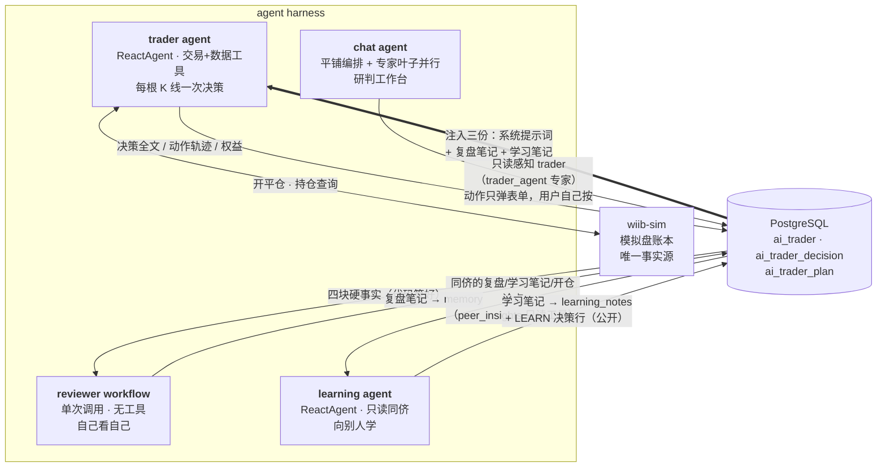
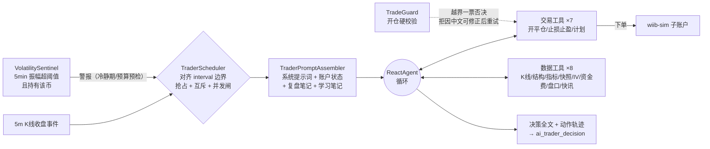
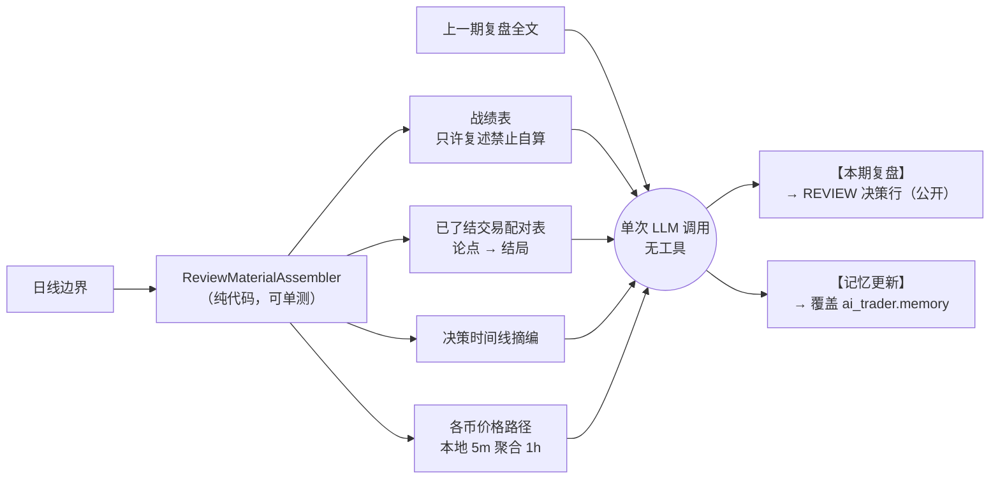
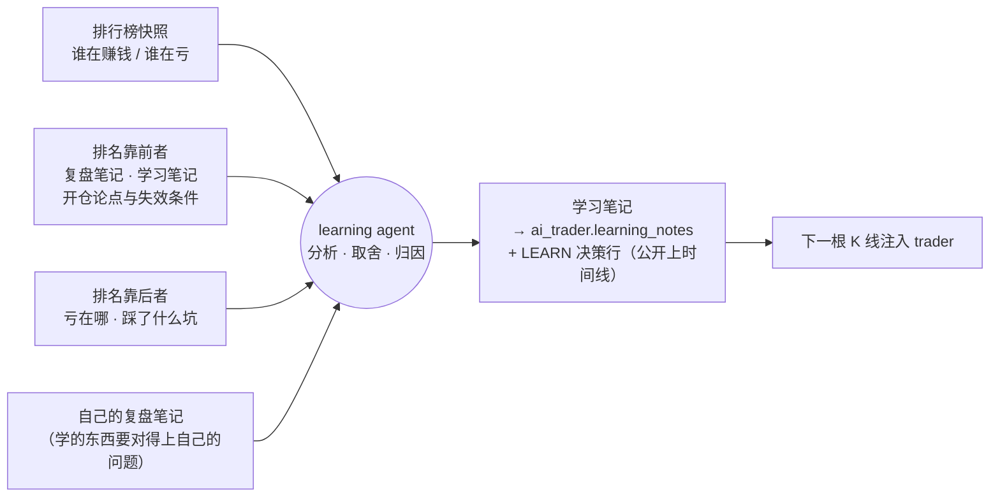
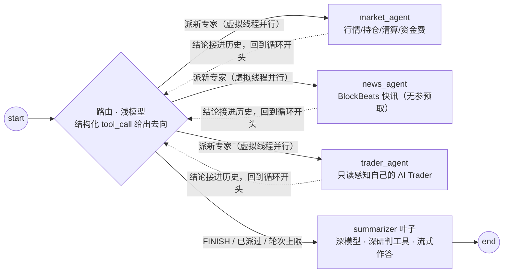
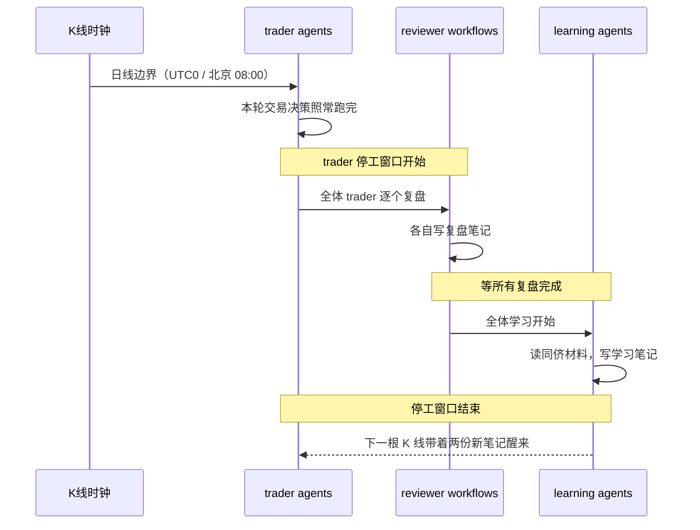

# Agent Harness 架构

这份文档讲平台里那套 LLM 装置：六处用法各自是什么形态、循环怎么停、彼此如何只经 PostgreSQL 咬合，以及每一处的设计取舍。视角是"这套东西是什么、为什么这么搭"。

配套的代码阅读指南见同目录 [tutorial.md](./tutorial.md)。

平台里有六处独立的 LLM 用法，形态和停止条件各不相同。它们之间不直接调用，只通过 PostgreSQL 交换数据，加一套新的不用改旧的。

图引擎用 langgraph4j 1.8.20（spring-ai-alibaba 的上游），只用在叶子 ReactAgent 上。取舍原则是：能写死成代码的固定步骤就写死，只有开放决策才交给模型循环。六处里三处是真正的 agent（trader / learning / chat），另外三处是一次性调用。

| 装置 | 形态 | 工具 | 循环 | 触发 | 模型来源 | 产出 |
|---|---|:---:|:---:|---|---|---|
| **trader agent** | ReactAgent | 15 | ✓ 上限 8 次调用 | 每根 K 线收盘 / 波动警报 | 主人的 key | 真实开平仓 + 决策行 |
| **reviewer workflow** | 单次调用 | 0 | ✗ | 日线边界 | 同 trader | 复盘笔记 |
| **learning agent** | ReactAgent | 1（只读同侪） | ✓ 上限 8 次调用 | 全体复盘之后（屏障） | 同 trader | 学习笔记 |
| **chat agent** | 平铺编排 + ReactAgent 叶子 | 分层 | ✓ 带回环 | 用户提问 | 用户的 key | 流式回答 |
| **replay coach** | 单次调用 | 0 | ✗ | 手动复盘里点「AI 提示 / AI 评估」 | 用户的 key | 盘面提示 / 整局操作评估 |
| **behavior workflow** | 单次调用 | 0 | ✗ | 用户点「分析我」 | 平台配置 | 行为画像报告 |

模型来源：交易、对话、复盘教练全部 BYOK（用户自带 key，AES-GCM 加密存库），统一放在一个端点库里，按用途绑定。交易员一天自动跑几十上百轮要便宜稳，对话是按需的深度研判要强模型，所以允许各绑各的端点；只配一条时它就是全局默认。平台自己只为 behavior（行为分析）和 news-tagging（快讯打标）两个功能位建模型（`ai_runtime_config` + `ai_model_assignment`）。

behavior 不做成 agent 的原因：它那 10 个数据源的参数都是 `userId`、端点固定，模型没有决策空间，套 ReactAgent 只是多跑几趟，所以就是并发拉 10 个端点、拼一个 prompt、调一次 LLM。

## 全景：交易那四套如何经 DB 咬合

（`behavior` 不在这张图里，它读的是 wiib-sim 的用户行为数据，与交易这条链没有交集。）



trader 每次唤醒收到三份注入：平台系统提示词（身份 / 规格 / 纪律）、复盘笔记（自己的教训）、学习笔记（从别人那学到的）。三份并列不合并，来源分开模型才分得清哪条是自己的教训、哪条是学来的。trader 只读这些笔记，不关心是谁写的，以后再加一份新笔记也不用改 trader。

## trader agent：唯一会动真账本的



- 四道外部停止条件：单轮模型调用上限 8 次、唤醒预算（截止到下一根 K 线前 5 秒）、单轮 600 秒上限、连续 5 次失败自动暂停。都在模型之外，模型改不了。
- 仓位规格（杠杆区间 / 保证金占比 / 单仓 / 双开）由 `TradeGuard` 校验，越界直接拒绝而不是截断：平台悄悄把数字改小，模型不知道，后面的止损计算全是错的。
- 开仓必须给论点标签、数据引用、失效条件，落 `ai_trader_plan`，每次唤醒原样注入。退出只有三条路：止损带走、止盈带走、失效条件触发后主动平。计划归档不删，是 reviewer 的原料。
- BYOK：用户自带 key 与模型（AES-GCM 加密存库，baseUrl 走 SSRF 白名单校验）。

## reviewer workflow：自己看自己

它不是 agent：没有工具、没有循环，一次调用进去出来。素材由代码算齐，模型只负责解读，没有机会自己去挑一段对自己有利的行情。



- 防止自夸的三条：战绩数字代码注入、只许复述；先找错误再找亮点；教训条数设上限，防泛泛而谈刷篇幅。
- 滚动继承：只注入上一期复盘（不是全部历史），但要求这一期把仍然成立的教训继承进来，因为下一期同样只看得到这一篇。输入不膨胀，靠输出完成继承。
- 降级安全：缺分隔符时 REVIEW 行照存、memory 不动，一次格式失守不污染记忆；复盘失败不计连败（没有资金风险）。

## learning agent：向别人学

reviewer 回答"我哪儿错了"，learning 回答"别人做对了什么，其中哪些对我真的有用"。

它做成 agent 是因为要在一堆同侪材料里自己判断哪些值得学、哪些是幸存者偏差、哪些是差 trader 的前车之鉴，这是开放决策，写不成固定步骤。



- 形态：ReactAgent + 唯一只读工具 `peer_insights`（单工具双模式：无参回排行榜，传 traderId 深看某人的复盘全文 / 学习笔记 / 在场计划论点 / 论点→结局配对）。排行榜、自己的复盘笔记、上一份学习笔记随开场白代码注入；看谁、看几个、看多深由模型自己定。
- 反照抄三条：【不学什么】是必填段（只会说"值得学"的等于没学，缺了判格式失守）；每条学习必须带证据与差距数字；引用同侪战绩必须带笔数，样本少的时候运气和方法看起来一样。
- 降级安全：格式失守时 ERROR 行留痕、learning_notes 不动；学习失败不计连败。同侪不足 3 人时整体跳过。
- 滚动继承：与复盘笔记同款，产出整份覆盖 learning_notes，下期只看得到这一份。

待定（尚未决策）：agent 之间开"会议"互相提问讨论。想法记在这里，但差模型拖累好模型是真实风险，且多轮对话成本是乘法增长，暂不做。

## chat agent：研判工作台

编排是 `ChatTurnRunner` 里的普通 Java 循环，不是 StateGraph：这段编排里分支就是 if、并行就是虚拟线程、回环就是 while，用不上图。图只留给叶子：三个专家与 summarizer 各自是独立编译的 `ReactAgent` 子图，那里的 ReAct 循环确实是框架在管。



- 路由：浅模型调 route 工具给出结构化去向，循环只认这个值，不解析消息文本。summarizer 一个字都不提"要不要再派发"，让它同时纠结作答和派发就会在两者之间反复横跳。
- 并行与停止：专家在虚拟线程上并行跑；同一专家整轮只派一次（去重名单），另设 3 轮派发上限兜底。
- trader 联动：`trader_agent` 专家只读用户自己的 AI Trader（概况 / 持仓 / 决策 / 计划）；`wake_trader` / `review_trader_now` / `leave_note_to_trader` 只往对话里推一张表单（留言连草稿带轮次一起预填），按下按钮的是用户，模型碰不到执行路径；只有当场就烧钱的 `run_deep_analysis` 走 HITL 闸。
- 韧性：自研 `ResilientChatService` 装配进 `ReactAgent.ChatService`，对叶子透明。流式路径带退避重试，仅在尚未吐帧时重订阅。不挂兜底模型：BYOK 只有一个端点，切到同端点的另一个模型没有意义。
- 横切：会话历史落 `workbench_chat_context` 自建表（终态整体覆盖写入）、跨会话长期记忆（规则化写入，不烧 LLM）、调用限额 + 历史摘要压缩控预算。
- 新闻双源分工：`news_agent` 出 BlockBeats 清单，summarizer 用联网搜索补充合并，独有条目带源标签。服务端搜索关不掉，与其硬压不如分工。
- 协议适配：openai（chat/completions，走 Spring AI `OpenAiChatModel`）与 responses（自研 `ResponsesChatModel`）两条协议的挂工具与 tool_choice 由 `ToolChoice` 统一处理，首轮强制用工具按次落地，两条路行为一致。

### 模型来自用户，所以图也跟着用户走

```text
POST /api/ai/workbench/chat
  ├─ 解析端点（LlmEndpointService.chatEndpoints：CHAT_MAIN 绑定→默认端点） 一条都没有 → 2201，前端顶出配置弹窗
  ├─ 按指纹取/建专家叶子（LRU 32） 建不出 → 2202，同上
  ├─ 并发闸门 tryAcquire          该用户已有一轮 → 2203 ／ 全局 10 满 → 2204
  └─ 这之后才 new SseEmitter
```

四道准入都在建流之前：一旦返回 `SseEmitter`，响应就是 `text/event-stream`，再报错只能推 error 事件，前端拿不到结构化错误码、没法自动引导去配置。

- 叶子按指纹缓存，userId 必须进指纹：指纹 = `SHA-256(userId + 主/轻两条端点各自的协议 / baseUrl / 模型 / 思考档位 / 密文)`。用户改配置指纹就变，自然拿到新叶子，不需要显式失效。userId 进指纹不是为了缓存粒度，是数据隔离：叶子里有按用户烤死的工具（trader_agent 读的是"这个人的 trader"），两人共用一份叶子就会看到别人的持仓；隔离要靠键本身，不能指望密文的随机性。
- 主模型 + 轻模型：轻模型（可选绑定 CHAT_LIGHT）跑 router / 专家 / 历史压缩，主模型只写最终回答。不绑就复用主模型实例本身，省一份客户端和连接池。
- 思考档位（`none/low/medium/high`）是端点属性，每条端点各自配；轻模型绑到别的端点就用那条自己的档位。模型支不支持这个参数查不到（OpenAI 标准 `/v1/models` 只回 id/object/created/owned_by），所以默认留空不传，由用户自己选，配套一个「测试连通性」按钮真发一次请求验。
- 错误归类：401/403、429、404+model、超时 / 连不上各给一句能照着做的话；认不出来的不替用户判病因，因为那个 catch 罩着落历史、写记忆、checkpoint 落库，数据库挂了也走这条路，兜底要是说"请检查端点与模型配置"，用户会去乱改一把本来没问题的 key。任何分支都不回显上游原文：中转网关的异常里经常带完整请求 URL（`?api_key=…`），正则追不全 key 的形态。

### HITL：判断要发生在信息完整的那一层

`run_deep_analysis` 一次烧三次深模型调用，必须用户点头。闸门不在工具内部，而是 `EdgeHook.WrapCall` 挂在 summarizer 的工具边上：

```text
授权键 = (sessionId, 工具名, 归一化后的标的)
```

工具方法体看不到自己被调用时的 sessionId（`ChatService.execute(List<Message>)` 的签名里没有 `RunnableConfig`），而 hook 拿得到 `threadId` 和待执行 tool_call 的名字与参数。所以卡片上写 BTCUSDT、模型改口要 ETHUSDT 时键不匹配，会重新弹卡。这不是多加一道校验，是把判断挪到了信息完整的那一层。

## 日线边界的时序

一天一次的交接（`TraderScheduler.startDailyHandover`）：先交易，再全体复盘，最后全体学习。复盘与学习期间 trader 停工，因为它们要读的是"已经定格的一天"，边写边读会读到半截数据。停工窗口挡住全部四个唤醒入口（例行 K 线 / 波动警报 / 手动唤醒 / 点播复盘），窗口内的 K 线事件直接丢弃不补跑；复盘与学习之间是全局屏障，learning 读的是同侪刚写好的复盘，没有屏障，同一轮学习里各人看到的世界就不一样。



窗口时长上界约等于复盘超时 600s + 学习超时 300s（两阶段各自内部并行、并发闸 10 槽，超过 10 人按批次再乘）。这是上界不是常态——两阶段都跑完就关。5m 档 trader 最多丢 3 根 K 线、15m 档 1 根，日线交接每天只有一次，可接受。

chat 与 trader 的联动只到这一步：`trader_agent` 专家只读用户自己的 trader（memory / learning_notes / 决策行 / 计划），三个动作只弹表单，真执行走 trader 动作面板的 REST。learning 只写笔记列与决策行，chat 只读同样几样东西，两边都不碰 trader 本体。
