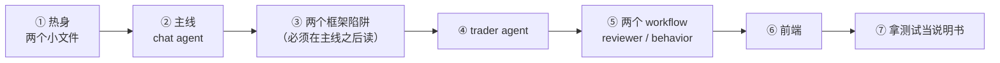

# Agent Harness 阅读指南

**这份文档解决一个问题**：`agent/` 目录下有 7000 多行代码，从哪儿开始读、按什么顺序读、读到哪一段该停下来先补背景。

它不是 API 文档，也不重复 [architecture.md](./architecture.md) 已经讲过的架构。那份文档回答"这套东西是什么"，这份文档回答"**我该按什么顺序把它读懂**"。

> **行号会漂。** 文中的 `文件:行号` 是写作时的快照，代码一改就不准了。行号只用来告诉你"大概在文件的哪个位置"，真要定位请按**方法名** grep。

---

## 第 0 章 · 先建立地图（10 分钟，只读不写代码）

读同目录的 [Agent Harness 架构](./architecture.md)，只需要记住三件事：

1. **五套装置，互相之间只经 PostgreSQL 解耦**。没有任何一个直接调用另一个。
2. **选型只有一条准则**：固定步骤写死成代码，开放决策才交给模型循环。五套里三套是真 agent（trader、learning、chat），另两套是一次性 workflow（reviewer、behavior）。同一条准则也管形态内部：chat 的**编排**是普通 Java 循环（ChatTurnRunner），只有**叶子**用 ReactAgent——编排是固定步骤，叶子里的 ReAct 才是开放决策。
3. **模型来源两条轨**：交易和对话都是 BYOK（用户自带 key），平台只为 `behavior` 一个功能位建模型。

记住这三条就够了，细节读代码时自然会撞上。

**建议的阅读顺序**（后面每一章对应一站）：



**为什么从 chat 开始而不是从 trader**：trader 是业务最重的（要动真账本、有护栏、有调度），chat 是**框架用得最深的**。先啃框架，再看业务，比反过来省力——因为 trader 里那些看着奇怪的写法，多半在 chat 里也出现过，而且 chat 那边有注释解释过为什么。

---

## 第 1 章 · 热身：两个小文件（20 分钟）

目的是熟悉这个仓库的代码风格和注释密度，别一上来就啃 740 行的大文件。

| 文件 | 行数 | 读它干什么 |
|---|---|---|
| `agent/chat/ChatConcurrencyGate.java` | 58 | 全包最简单的一个类。看两件事：`tryAcquire` 为什么**先占用户位再占全局位**（反过来会让同一用户的第二次请求先拿走一个全局名额再被拒，中间那一瞬别人被无谓挡住）；为什么返回**枚举而不是 boolean**（拒因得由闸门自己给，让调用方去别处二次推断既是重新发明轮子又有竞态） |
| `agent/chat/ToolRunContext.java` | 34 | 一个 ThreadLocal。读完你会问"为什么要靠 ThreadLocal 传东西"——这个问题的答案就是第 2 章主线的核心，先把疑惑留着 |

读完这两个，你应该能感觉到：**这个仓库的注释讲"为什么"不讲"做了什么"**。看到一段费解的代码，先找它头上那句注释，多半解释了它为什么不能写成更直觉的样子。

---

## 第 2 章 · 主线：一次对话从点击到出字（2~3 小时）

这是整份指南的主体。按下面的顺序读，每一站都是上一站的直接下游。

### 站点表

| # | 站点 | 位置 | 看什么 |
|---|---|---|---|
| 1 | 入口 | `ChatWorkbenchController.chat()` (~:95) | 四道准入闸 |
| 2 | 配置从哪来 | `agent/llm/LlmEndpointService.java` | 端点库 CRUD、用途绑定、解析（chatEndpoints）、探测 |
| 3 | 配置怎么变模型 | `ChatModelFactory.modelsFor` / `fingerprint` | 指纹缓存 |
| 4 | 叶子怎么建 | `ChatAgentFactory.leavesFor` | 模型在建叶子这一刻绑定；LRU 按指纹（userId 在指纹里，是数据隔离不是缓存粒度） |
| 5 | 一轮怎么编排 | `ChatTurnRunner`（先读类 javadoc 的 ASCII 图） | 路由循环 / 并行派发 / 汇总——全是普通 Java：分支就是 if、并行就是虚拟线程、回环就是 while |
| 6 | hook 挂载 | `ChatAgentFactory.summarizerToolHooks` (~:239) | 顺序即语义（内层→外层，写反不报错），钉子在 `ApprovalGateOrderTest` |
| 7 | 推流 | `ChatWorkbenchController.run()` | SSE 逐帧；并发名额的 release 收在哪一层 |
| 8 | HITL | `ApprovalGate.applyWrap` (~:58) → `ApprovalRegistry` | 三元组授权 |

### 站点 1 · 入口

`chat()` 里四道检查全部挤在 `new SseEmitter` **之前**，这不是风格问题：一旦返回 SseEmitter，响应就是 `text/event-stream`，再报错只能推 error 事件，前端拿不到结构化错误码、没法自动引导用户去配置。

四个错误码 `2201~2204`（没配置 / 建不出模型 / 你已有一轮在跑 / 全局满了）。

> 顺带记一个坑：`ErrorCode` 是 Java 枚举，**不校验 code 重复**。撞号了编译过、测试过，只在运行时错乱——用户做加密货币交易遇到"无法获取实时价格"会被弹成"去配置 LLM 端点"。加错误码前先扫一遍已占段位。

**名额泄漏是这套设计里唯一不可恢复的失败模式**：漏满 10 个，服务对所有人永久拒绝。所以看 `release` 收在哪一层——它在**提交出去那个 lambda 的 finally**，不在 `run()` 的 finally。因为 `run()` 开头的心跳调度在它自己的 try 之外，抛了 finally 根本不执行。

### 站点 2~3 · 配置怎么变成模型

`LlmEndpointService` 里有一处值得单看：`create/update` 和 `testConnection` **共用同一份 `toRow` 组装**。不共用就会出现"测通了但存进去的不是它"。同理，连通性探测走的是 `ChatModelFactory` 的**生产建模路径**，不是另搭一个形似的探针——测什么就得是接下来真跑什么。

`ChatModelFactory` 是理解整套设计的钥匙，两个点：

- **缓存键是配置指纹，不是 userId**。用户改配置 → 指纹变 → 自然拿到新模型，**不需要任何显式失效逻辑**。
- **建模不在锁里做**。写成 `synchronizedMap(...).computeIfAbsent(k, fn)` 的话，mapping 函数整个执行期间持锁，而这条路在准入同步路径（Tomcat 请求线程）上——任何一个用户首次建模期间，其余所有人的 `/chat` 全堵住。所以是 `get` → 锁外建 → `putIfAbsent`。

### 站点 4~5 · 叶子与编排

`leavesFor()` 建叶子。重点是**模型在建叶子这一刻被构造进工具实例**：

> BYOK 之后"当前是哪个用户"只有建叶子这一层知道。工具方法体里再去现取就取错人了。这也是 userId 必须进缓存指纹的原因——叶子里有按用户烤死的工具（trader_agent 读的是"这个人的 trader"），两人共用一份叶子就是把别人的持仓端到对方眼前。

`ChatTurnRunner` 是一轮对话的编排，先读类 javadoc 顶上的 ASCII 图。三个零件：

- **路由**：浅模型调 route 工具给出结构化去向，循环只认这个值，**一个字都不解析消息文本**。角色单一是关键——summarizer 一个字都不提"要不要再派发"，让它同时纠结"该作答还是该派发"就会在两者之间反复横跳。
- **并行**：派出的专家跑在虚拟线程上，收齐后**按派发顺序**接进历史——顺序稳定，产出才可复现。
- **停止**：真正让循环停下来的是**去重**（每轮至少吃掉一个专家名，名字用完必停）；`MAX_DISPATCH_ROUNDS = 3` 兜的是"去重失灵"。现在正好三个专家，这个数没有余量，加专家要一起抬。

### 站点 6 · hook 挂载

`summarizerToolHooks` 只有两行，但**顺序就是语义**（内层 → 外层，见第 3 章陷阱 ①）。写反了代码照跑什么都不报错，钉子在 `ApprovalGateOrderTest`。

### 站点 7 · 推流

`run()` 里看两样：token 怎么一帧一帧变成 SSE；并发名额的 `release` 收在**提交出去那个 lambda 的 finally**（理由见站点 1——名额泄漏是唯一不可恢复的失败模式）。

### 站点 8 · HITL

先理解约束：`DeepAnalysisToolkit` 的方法体**从来看不到自己被调用时的 sessionId**——`ChatService.execute(List<Message>)` 的签名里就没有 `RunnableConfig`，递不进去。授权若只绑 sessionId，就会是"卡片上写 BTC、模型改口跑 ETH 照样放行"。

修法不是加校验，是**把判断挪到信息完整的那一层**。`EdgeHook.WrapCall` 拿得到 `threadId`（= sessionId）+ 待执行 tool_call 的名字和参数，所以授权键能做成：

```
(sessionId, 工具名, 归一化后的标的)
```

看 `ApprovalGate` 怎么从 tool_call 的 **JSON 字符串**参数里抠出 symbol（`ToolCall.arguments()` 是字符串不是 Map），以及为什么白名单外的标的要**保留自己的键**而不是兜底成某个默认值——兜底成 `BTCUSDT` 会让"批了 BTC"的授权把一个 SOL 请求直接放行，比不归一化更危险。

`ApprovalRegistry` 里注意三处内存清理的理由，尤其 `discardApprovals`：又要弹卡就说明上一条授权已经用不上了，不丢的话它会一直躺到 TTL 结束，而路由见 `hasApproval` 为真就跳过全部专家派发——于是这 10 分钟内该会话每一条新提问都不取数据、直接凭空作答，**且没有任何日志会说明原因**。

---

## 第 3 章 · 两个框架陷阱（读完回头看站点 6）

langgraph4j 有几处行为跟直觉相反，而且**错了不报错**。这几条都是实跑撞出来的，不是从文档抄的。

### ① hook 的执行顺序跟注册顺序是反的

`EdgeHook.WrapCall` 是 **reduce 左折叠**（FIFO 存储），注册 h1、h2、h3 实际执行 `h3(h2(h1(真实工具执行)))`——**最后注册的在最外层、最先执行**。

所以保险丝（调用上限）必须**后**注册。写反了代码照跑什么都不报错，只在"ReAct 已逼近调用上限、这时用户要深研判"这个特定情况下出问题：卡片弹出来了，但模型没配额告诉用户发生了什么。

还有一层更硬的后果：闸门在外层短路时压根不调 `action.apply`，内层的调用上限整个被跳过、那一跳不计数——**保险丝会静默少数**，调用预算失准。

### ② 内容相同的消息会被静默丢弃

`MessagesState.SCHEMA` 用的是 `ReducerDisallowDuplicate`，按 `Objects.hash` 去重。测试里连着构造两条内容相同的消息，**第二条被静默丢掉**，症状是下游报 `no AssistantMessage provided!` ——错误信息跟真正的原因八竿子打不着。

这个坑在本仓库被三个人各踩过一次，现已结构性堵死：所有建图点统一从 `AgentGraphs.reactAgent(model, systemPrompt)` 起步（`agent/llm/AgentGraphs`），schema（`appenderWithDuplicate`，见 `agent/llm/MessagesSchema`）、serializer、系统提示三样约定内置在入口里。新增建图点走它即可，没有机会漏。

### 附：其他值得知道的框架事实

| 事实 | 为什么要知道 |
|---|---|
| `new Command(null, update)` 必然 NPE | `gotoNode()` 是 `requireNonNull`，而框架拿到 hook 返回值第一件事就是调它。`Command.emptyCommand().withMergedUpdate()` 一样炸 |
| **token 帧不吃迭代格** | 帧走生成器栈顶，不经过 `AsyncNodeGenerator.next()`，而迭代计数只活在后者里。长回答不会撞叶子的递归硬顶（默认 25） |
| `ResilientChatService` 会**静默吞掉系统提示** | 它取 `systemMessage().orElse("You are a helpful AI Assistant…")`——忘了传 `defaultSystem` 时，你的系统提示被换成框架默认串，**不报错**。靠系统提示带 JSON Schema 的地方，整份 schema 会直接消失。建图路已被 `AgentGraphs` 拦住（systemPrompt 必填、空值当场抛）；绕开它的只有 behavior 与复盘教练两处不建图的借用，那里要自己记得传 |

---

## 第 4 章 · trader agent（2 小时）

业务最重的一套。但它的框架用法比 chat 简单——一个独立编译的 `ReactAgent`，没有多专家编排。

### 读的顺序

| # | 位置 | 看什么 |
|---|---|---|
| 1 | `TraderScheduler.onKlineClosed` | 谁来敲门：K 线收盘事件 → 对齐 interval 边界 → 抢占 + 互斥 + 并发闸 |
| 2 | `TraderScheduler.startDailyHandover` | 日线交接三阶段：交易 → 全体复盘 → 屏障 → 全体学习；停工窗口挡例行/警报/手动/点播四个入口 |
| 3 | `TraderScheduler.tryAlertWake` | 第三个入口：持仓极端波动时哨兵临时唤醒（带冷静期和预算预检） |
| 4 | `TraderWakeupRunner` 的四个常量 | **四层外生停止条件**：单轮 600s、模型调用上限 8 次、唤醒预算（截止 = 下一根 K 线前 5s）、连续 5 次失败自动暂停 |
| 5 | `TraderWakeupRunner.wake` | 一次唤醒的完整生命周期 |
| 6 | `TraderPromptAssembler` | 注入了什么：系统提示词 + 账户状态 + 复盘笔记 + 学习笔记（两份笔记并列不合并——来源分开，模型才分得清自己的教训和从别人学的） |
| 7 | `TradeGuard` | 仓位规格硬校验 |
| 8 | `TradeTools` | 7 个交易工具（数据那 8 个在 `toolkit/`）。**不用逐个读**，挑两三个看形状即可 |

### 三个设计点

- **模型无权突破任何一条停止条件**。四层都是外生的——写在代码里，不在提示词里。提示词里的约束模型可以无视，代码里的不行。
- **事实裁定归代码**：越界**拒绝不截断**。平台悄悄把杠杆从 50 改成 20，模型不知道自己被改了，后续所有止损计算全错。拒因用中文给回去，模型可以修正后重试。
- **计划即承诺**：开仓必须给论点标签、数据引用、失效条件，落 `ai_trader_plan`，每次唤醒原样回注。退出只有三条路——止损带走、止盈带走、失效条件触发后主动平。计划归档不删，是 reviewer 的原料。

---

## 第 5 章 · learning 与两个 workflow：什么时候该/不该用 agent（1.5 小时）

`agent/learning/` 包里住着一对形态相反的东西：reviewer 是单次调用的 workflow，learning 是带工具循环的 ReactAgent。**对比读这两个，就是"选型准则"最好的教材**——素材算得齐的（复盘）不给模型循环，需要甄别的（向同侪学）才给。

### learning agent：`agent/learning/`

| 位置 | 看什么 |
|---|---|
| `PeerInsightService` | 纯代码只读查询：排行榜快照 + 单 trader 详情，两个方法都吐拼好的中文文本块。样本量披露（每行硬带笔数）是设计红线 |
| `PeerInsightToolkit` | 单工具双模式（无参=排行榜、传 traderId=详情）；每次会话 new 一个绑定"我是谁" |
| `LearningRunner.learn` | ReactAgent 用法与 `TraderWakeupRunner.runAgentSession` 同构（`AgentGraphs.reactAgent` 起步 / 保险丝 / trace / finally 落用量）；输出契约校验——缺【不学什么】就是格式失守，ERROR 行留痕、笔记不动 |
| `LearningRunner.systemPrompt` | **反照抄三件套**：不学什么必填、每条带证据与差距数字、引用战绩必须带笔数 |

### reviewer：`agent/learning/`

| 位置 | 看什么 |
|---|---|
| `ReviewMaterialAssembler` (526 行) | 纯代码算素材，可单测。战绩表、已了结交易配对表、决策时间线、价格路径 |
| `ReviewRunner.review` (~:59) | 一次调用进去出来，无工具无循环 |
| `ReviewRunner.systemPrompt` (~:167) | **防自夸三件套**：战绩数字代码注入且只许复述、"先找错误再找亮点"、教训条数上限 |

**为什么不给它工具**：给了它就能自己去查一段对自己有利的行情来自证。素材由代码算齐、模型只负责解读，这是有意的约束。

**滚动继承**这个设计值得单独想一想：只回注**上一期**复盘，但要求这一期必须把仍然成立的教训继承进来——因为下一期同样只看得到这一篇。**输入不膨胀的前提，是输出完成了继承。**

### behavior：`agent/behavior/`

395 行，全包最好读的一套。

`BehaviorAnalysisWorkflow.run` (~:46)：并发拉 10 个 sim 端点 → 拼一个 prompt → 调**一次** LLM。

它不配 ReactAgent，落到底是一次 `model.call`。**理由值得记住**：那 10 个工具的参数全是 `userId`、端点写死，模型零决策自由度。配 ReAct 等于让它来回跑腿——多花钱、多花时间、还多了一堆失败模式，换不来任何决策质量。

看 `chatService` (~:65) 那段：它借 `ReactAgent.builder()` 只为捎上系统提示（不挂工具、不 build），落到底是一次 `model.call`。这是在不改只读包的前提下唯一的公开构造路径。

---

## 第 6 章 · 前端（1 小时）

1222 行，比后端好读得多。

| 顺序 | 文件 | 行数 | 看什么 |
|---|---|---|---|
| 1 | `components/workbench/Workbench.tsx` | 169 | **三态**：加载中 / 有配置渲染对话 / 没配置渲染引导卡。中间那个"加载中"态不能省——不然每次进页面都会先闪一下"去配置" |
| 2 | `components/workbench/LlmConfigBall.tsx` | 103 | 浮动球 + 配置弹窗 |
| 3 | `components/LlmEndpointForm.tsx` | 214 | trader 与对话**共用**的表单 |
| 4 | `components/workbench/chatStore.ts` | 282 | **手写的外部 store，不是 zustand**（`subscribe` / `getSnapshot` + `useSyncExternalStore`） |
| 5 | `components/workbench/ChatPanel.tsx` | 339 | SSE 消费与渲染 |

### 一条值得专门跟一遍的链

```
后端返 2201
  → api/index.ts 抛带 code 的 ApiError
  → chatStore 的 catch 置 needsConfig
  → LlmConfigBall 的 effect 把弹窗顶出来，并立刻清标记
```

**断任何一环，"没配 key 自动跳配置"就退化成一行红字。** 引导卡上那个"去配置"按钮走的也是这条链（置标记而不是自己提 open 状态）。

清标记那步不能省：不清的话用户关掉弹窗会被反复顶开。

---

## 第 7 章 · 拿测试当说明书

这个仓库的测试有不少是**建真图跑**的，比读代码快。

| 测试 | 它替你回答什么 |
|---|---|
| `ApprovalGateOrderTest` | hook 顺序对不对、闸门在真叶子上真的拦下了 |
| `ChatTurnRunnerTest` | 一轮编排的全部分支：路由/派发/去重/轮次上限/汇总 |
| `ExpertCallLimitTest` | 专家的调用上限怎么生效 |
| `TraderWakeupLoopTest` | mock 模型跑通真 ReactAgent 唤醒回路 |
| `LearningLoopTest` / `LearningHandoverLoopTest` | 学习单人回路 / 日线交接整链（真调度+真 runner+真查询，3 learner 并发） |
| `TraderSchedulerTest` | 三阶段时序、屏障不漏人、停工窗口挡四入口、异常不卡死窗口 |

### 判断一条测试值不值得信

这个仓库反复栽在"测试全绿但功能是坏的"上，几种典型形态：

- **恒真断言**：断 `.contains("模型")`，而兜底文案本身就含"模型"——删掉整条分支照样绿
- **断言点打错层**：在测试里自己 new 一个对象、自己加密、再验尾号——把生产代码改成明文落库照样绿
- **`any()` 吃掉一切**：`when(factory.leavesFor(any()))` 之后，"传给它的是不是本人那份配置"就没人守了
- **mock 遮蔽真跑**：所有直接调 `applyWrap` 的用例，对"这个 hook 根本没被框架调用"完全无感

**看到一条测试，先问：把它守的那段生产代码删掉，它会红吗？**

---

## 附录 A · 常用命令

```bash
# 后端全模块（-am 不能省，根 pom 有 skipTests=true）
mvn -o test -pl wiib-agent -am -DskipTests=false -Dsurefire.failIfNoSpecifiedTests=false

# 单个/多个测试类（逗号分隔，不是 +）
mvn -o test -pl wiib-agent -am -DskipTests=false -Dsurefire.failIfNoSpecifiedTests=false \
    -Dtest=ApprovalGateOrderTest,SummarizerHookMountTest

# 前端
cd wiib-web && npx tsc -b && npm run build
```

**几个会骗你的坑**：

- `-Dtest=A+B+C` 用 `+` 分隔是错的（surefire 认逗号），配上 `failIfNoSpecifiedTests=false` 就是**静默跑 0 个测试报 BUILD SUCCESS**
- 管道到 `grep`/`head` 会因 SIGPIPE 把失败的构建显示成 BUILD SUCCESS，用 `tail` 或不管道；`-q` 会吞掉汇总行
- `target/surefire-reports` 里有已删探针类的残留报告，手工统计 XML 会多算，**以 maven 汇总行为准**
- 本机跑 Binance 请求会返 **451 地域封锁**，market 专家全程 `available=false`——**本地真跑验不了行情链路**，要上服务器

## 附录 B · 真跑才能验的东西

单测覆盖不到的，需要 `WIIB_REAL_RUN=1` + 真实上游：

- hook 在生产装配下真的被执行到（挂错了不报错也不告警，单测全绿也发现不了）
- 工具执行链是否全程同线程（ThreadLocal 传进度依赖这个）
- 批准"深研判 BTCUSDT"后诱导模型去查 ETH，应该**重新弹卡**
- 重新弹卡之后再问普通行情问题，专家必须照常派发（验残留授权被丢弃）
- 思考档位传给不支持的模型会怎样——**模型支不支持这个参数查不到**，只能真跑
- 两个用户各用各的 key，互相看不到对方会话
