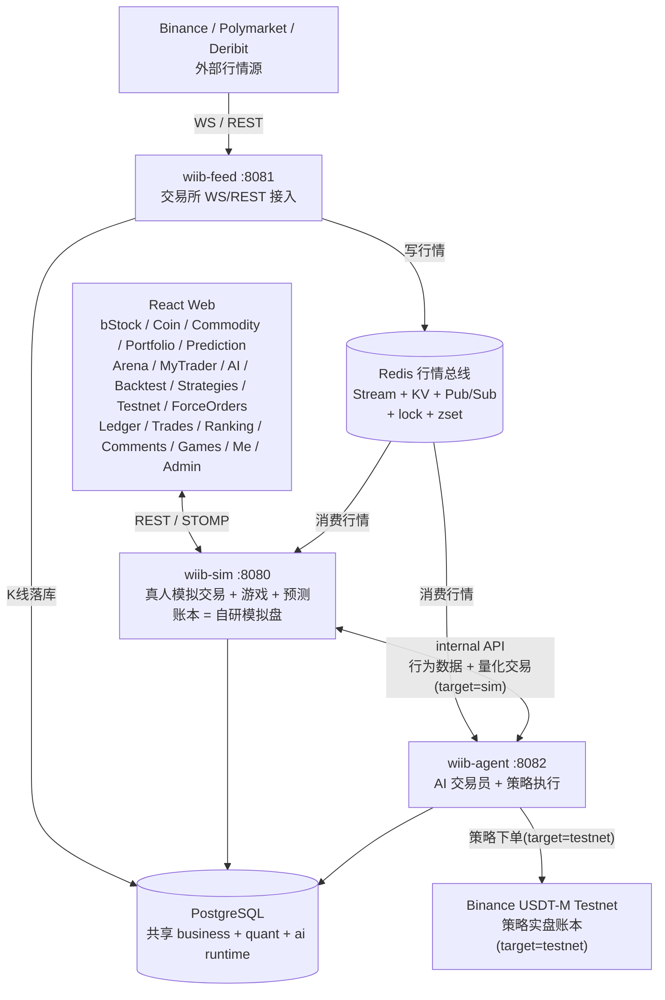

# 系统架构

这份文档从进程与数据流的视角讲整个平台：三个后端进程如何分工、行情从交易所走到前端经过哪些环节、代码目录怎么摆、并发与一致性靠哪些机制兜住。

wiib-agent 里那套 LLM 装置单独成篇，见 [Agent Harness 架构](./agent-harness/architecture.md)。

## 总览



---

## 实时数据链路

### Binance

```text
wiib-feed（上游进程）  交易所 WS → Redis
  -> spot miniTicker        -> Redis 价格 KV + Pub/Sub(feed:price)
  -> futures markPrice@1s   -> Redis mark/指数价 KV + Pub/Sub(feed:price)
  -> forceOrder(全市场流)    -> 白名单过滤 -> force_order 表(DB, 天然跨进程)
  -> aggTrade               -> Redis Stream(market:orderflow:<sym>, quant 读侧聚合)
  -> depth20@100ms          -> Redis KV(DepthStreamCache)
  -> K 线收盘                -> Redis Stream(stream:kline:closed) + taker买量5m桶 KV + crypto 5m 落库
  -> WS 断线                 -> REST 轮询兜底保价, 重连后按区间高低价补触发限价/强平

wiib-sim / wiib-agent（消费进程）  从 Redis 消费 feed 写入的行情
  sim:   撮合/强平 + 预测回合消费
  agent: K线驱动预测/策略 + 波动哨兵
```

sim 订阅 `feed:price` 后做撮合（feed 本身不撮合）：价格更新触发现货限价单、永续强平、止损、止盈检查。

### Polymarket BTC 预测

```text
Polymarket live-data -> Chainlink BTC price -> /topic/prediction/price（展示价格线）
Polymarket CLOB      -> UP/DOWN bid/ask     -> /topic/prediction/market
5min window rotation -> 回合事件(lock/create/settle)走 Redis Stream 保 FIFO
                     -> sim 锁上轮 -> 拉 Polymarket 开/收盘价 -> 结算下注
```

动态手续费：`effectiveRate = 0.25 * (p * (1 - p))^2`，clamp 0.1% ~ 2%。

---

## 项目结构

后端 5 个 Maven module / 3 个独立进程（wiib-common 与 wiib-quant 是库，不单独起），经 Redis 行情总线和共享 PostgreSQL 协作。

```text
whatifibought/                        # Maven 多 module 聚合 reactor
├── pom.xml
├── .env.example                      # 环境配置模板（唯一需手工填值的文件，复制为 .env.local / .env）
├── start-local.ps1 / .bat            # 本地一键启动三服务（bat 为双击入口，转调 ps1）
├── docker-compose.yml                # 三进程编排（无私有值，配置全在 .env）
├── redis-compose.yml                 # Redis 主从 + 哨兵栈（可选）
├── sql/                              # init.sql（35 表）+ bstock.sql（bStock 静态表 + 种子）
│
├── wiib-common/                      # 共享层：被 feed/agent/quant/sim 共同依赖
│   └── market/ broadcast/ cache/ aspect/ mapper/ entity/ dto/ enums/ util/ ...
│                                     # 行情通道 / Depth·OrderFlow 缓存 / BinanceRestClient
│                                     # / KlineHistoryStore / ForceOrder mapper / InternalApiFilter
│
├── wiib-feed/                        # ① 数据流上游进程（:8081）
│   └── BinanceWsClient / PolymarketWsClient / KlineStreamCache / health(内部流健康+重试)
│
├── wiib-agent/                       # ② AI 交易员进程（:8082，唯一可执行进程，下单只走 sim 子账户）
│   │                                 # 纯 LLM harness：六处装置（非 LLM 代码都在 wiib-quant 库里）
│   ├── trader/                       # trader agent：调度/唤醒回路/提示词/交易工具/护栏
│   │                                 # + 计划存取 + 审批 + 波动哨兵 + 交易员模型工厂
│   ├── learning/                     # reviewer workflow + learning agent：素材组装（硬事实）+ 复盘/学习回路
│   ├── chat/                         # chat agent：router + 子 agent 并行 + summarizer + checkpoint
│   │                                 # + HITL 授权闸门 + 并发闸门
│   ├── behavior/                     # 行为分析 workflow
│   ├── analysis/                     # 深研判（工作台触发）+ 叙事对账 + 手动复盘的 AI 教练提示词
│   ├── toolkit/                      # LLM 工具类（trader / chat 两处共用，取数底座在 quant 的 market/）
│   ├── llm/                          # BYOK 端点库（LlmEndpointService / ByokModelBuilder）
│   │                                 # + ResilientChatService / Responses API / ToolChoice 协议适配
│   │                                 # + 摘要 / 调用限额 / 上游异常归类（给用户看的一句话）
│   ├── runtime/                      # 平台功能位模型分配（behavior / news-tagging，Admin 热更）
│   └── controller/ task/ mapper/ monitor/ config/
│                                     # AiAgent/Trader/LlmEndpoint/ReplayCoach 接口 / 快讯采集打标·叙事对账 / SaToken
│
├── wiib-quant/                       # ③ 量化能力库（非进程，被 wiib-agent 依赖并扫描挂载）
│   ├── market/                       # 行情数据链路：领域事件 / 采集→特征快照 / 取数缓存
│   │                                 # + 指标·结构计算器 + 期权/资金面/跨市场服务 + 收盘流消费
│   ├── research/                     # 量化研究库：因子/预测/标注/评估/风险指标
│   ├── strategy/                     # FIBO/SQZMOM/TURTLE + 回测引擎
│   │                                 # + 执行层(testnet|sim) + 账户监控
│   ├── external/                     # 进程外客户端：binance testnet / blockbeats / deribit
│   │                                 # / ETF 流爬取 / sim internal（行为数据 + 合约下单）
│   └── controller/ task/ mapper/     # ResearchEval/Strategy/Testnet/Backtest 接口 / 日历·K线采集
│
├── wiib-sim/                         # ④ 真人模拟交易进程（:8080，账本=自研模拟盘 DB，对外）
│   ├── ledger/                       # 资金记账切面：@Ledger + LedgerAspect + 行映射
│   └── controller/ service/ mapper/ config/ task/
│                                     # 交易(bStock/crypto/futures) / 游戏 / 预测 / 结算 / WS 网关
│                                     # + 账单·排行·全站成交·仓位历史
│                                     # + BehaviorDataController（internal API 供 agent 调）
│
└── wiib-web/                         # React 前端（精密终端风）
    └── src/                          # App.tsx / pages/ components/ hooks/ stores/ api/
```

---

## 并发与一致性

| 机制 | 用途 |
|---|---|
| Virtual Threads | WS 消息处理、量化采集、调度任务、异步广播 |
| Redis 分布式锁 | 订单、仓位、用户、游戏操作互斥 |
| 数据库 CAS | 订单、预测回合、结算状态机 |
| `UPDATE ... RETURNING` | 资金变动与变动后余额同条 SQL 取回，账本不重查、不产生读写间隙 |
| Redis ZSet | 限价单、强平价、止损、止盈触发索引 |
| Redis Pub/Sub | 多实例 WebSocket 广播 |
| Caffeine + Redis | 本地热缓存 + L2 分布式缓存 |
| single-flight | 行情快照组装：N 个会话同时问一个币只真采集一次，其余等同一份结果 |
| 信号量 + 用户集合 | 对话并发闸门（全局 10 轮 + 每用户 1 轮），超限直接拒绝不排队 |
| 熔断 + serve-stale | Binance 收到 429/418 记冷却期，期内不发请求改吐带年龄上限的旧数据（资金费 8h / 标记价 15min / 盘口不兜） |
